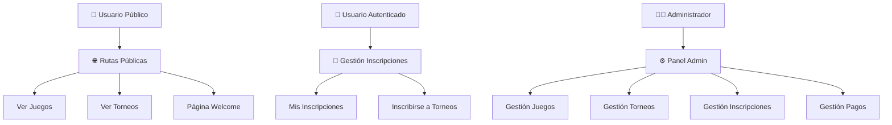
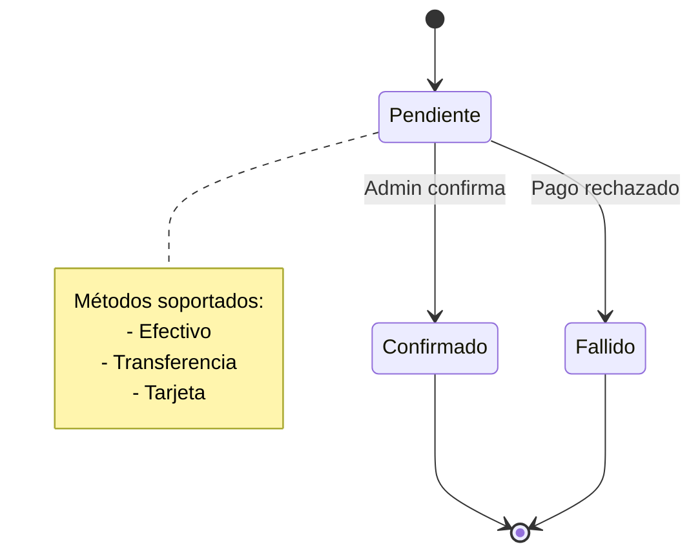
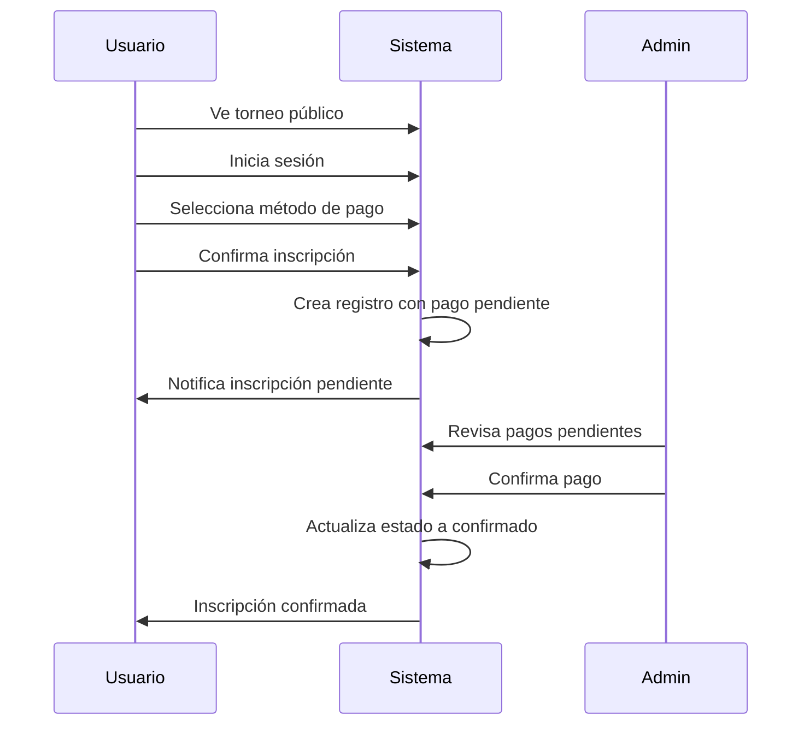

# 🏆 Documentación Vulca Torneos

**Plataforma de Gestión de Torneos TCG**

---

## 📋 Índice Principal

### 🎯 Descripción General
**Vulca Torneos** es una plataforma web completa para la gestión de torneos de Trading Card Games (TCG). Permite a los usuarios explorar juegos y torneos sin autenticación, inscribirse con login, y proporciona un panel administrativo completo para gestionar toda la plataforma.

### 🏗️ Arquitectura del Sistema

### 📁 Estructura de la Documentación

#### 🎮 **Controladores**
- [[AdminController]] - Gestión administrativa completa
- [[GameController]] - Gestión pública de juegos
- [[TournamentController]] - Gestión pública de torneos
- [[RegistrationController]] - Gestión de inscripciones

#### � **Form Requests**
- [[StoreRegistrationRequest]] - Validación de inscripciones

#### 🗂️ **Modelos**
- [[User Model]] - Usuarios con sistema de roles
- [[Game Model]] - Juegos TCG con slugs
- [[Tournament Model]] - Torneos y competencias
- [[Registration Model]] - Inscripciones y pagos

#### �🛣️ **Rutas**
- [[Rutas del Sistema]] - Documentación completa de rutas
- Rutas Públicas - Acceso sin autenticación
- Rutas Autenticadas - Requieren login
- Rutas Administrativas - Solo administradores

#### 🗄️ **Base de Datos**
- [[Esquema de Base de Datos]] - Estructura completa de BD
- Migraciones y relaciones
- Índices y optimizaciones

#### 🎨 **Frontend**
- [[Componentes React]] - Interfaz de usuario completa
- Páginas públicas y autenticadas
- Panel administrativo
- Diseño responsive

---

### 🔗 Navegación Rápida

#### � **Por Categoría**
- **🎮 Controladores**: [[AdminController]] • [[GameController]] • [[TournamentController]] • [[RegistrationController]]
- **📝 Validaciones**: [[StoreRegistrationRequest]]
- **🗂️ Modelos**: [[User Model]] • [[Game Model]] • [[Tournament Model]] • [[Registration Model]]
- **🛣️ Rutas**: [[Rutas del Sistema]]
- **🗄️ Base de Datos**: [[Esquema de Base de Datos]]
- **🎨 Frontend**: [[Componentes React]]

#### 🚀 **Por Funcionalidad**
- **👤 Gestión de Usuarios**: [[User Model]] → [[AdminController]] → Autenticación
- **🎮 Gestión de Juegos**: [[Game Model]] → [[GameController]] → [[AdminController]]
- **🏆 Gestión de Torneos**: [[Tournament Model]] → [[TournamentController]] → [[AdminController]]
- **📝 Inscripciones**: [[Registration Model]] → [[RegistrationController]] → [[StoreRegistrationRequest]]
- **💰 Pagos**: [[AdminController]] → Gestión de pagos → Confirmación manual

#### 🔄 **Flujo de Usuario**
1. **Usuario Anónimo**: [[Componentes React]] (Welcome) → [[GameController]] → [[TournamentController]]
2. **Usuario Registrado**: Login → [[RegistrationController]] → Gestión de inscripciones
3. **Administrador**: [[AdminController]] → Dashboard → Gestión completa del sistema

---

## 🚀 Funcionalidades Principales

### 👥 **Para Usuarios Públicos**
- ✅ Ver juegos disponibles
- ✅ Explorar torneos activos
- ✅ Ver detalles de torneos
- ✅ Navegación sin registro

### 🔐 **Para Usuarios Autenticados**
- ✅ Inscribirse a torneos
- ✅ Seleccionar método de pago
- ✅ Ver mis inscripciones
- ✅ Cancelar inscripciones

### 👨‍💼 **Para Administradores**
- ✅ CRUD completo de juegos
- ✅ CRUD completo de torneos
- ✅ Gestión de inscripciones
- ✅ Confirmación manual de pagos
- ✅ Dashboard con estadísticas
- ✅ Filtros avanzados

---

## 💳 Sistema de Pagos

---

## 🔄 Flujo de Inscripción

---

## 🛠️ Tecnologías Utilizadas

| Componente | Tecnología |
|------------|------------|
| **Backend** | Laravel 11 |
| **Frontend** | React + TypeScript |
| **Routing** | Inertia.js |
| **Styling** | Tailwind CSS + Shadcn/ui |
| **Database** | SQLite/MySQL |
| **Build** | Vite |

---

## 📊 Estadísticas del Proyecto

- **Controladores**: 4 principales
- **Rutas**: 25+ endpoints
- **Modelos**: 4 entidades principales
- **Vistas React**: 15+ componentes
- **Migraciones**: 5 tablas principales
- **Tests**: 51 tests con 137 assertions

---

## 🎯 Próximos Desarrollos

- [ ] **Pasarela de Pago Online**: Integración con Stripe/PayPal
- [ ] **Notificaciones Email**: Confirmaciones automáticas
- [ ] **Calendario de Torneos**: Vista mensual/semanal
- [ ] **Sistema de Reportes**: Análiticas avanzadas
- [ ] **API REST**: Para aplicaciones móviles
- [ ] **Chat en Vivo**: Soporte en tiempo real

---

*Documentación generada automáticamente para Obsidian*
*Última actualización: 3 de Julio, 2025*
