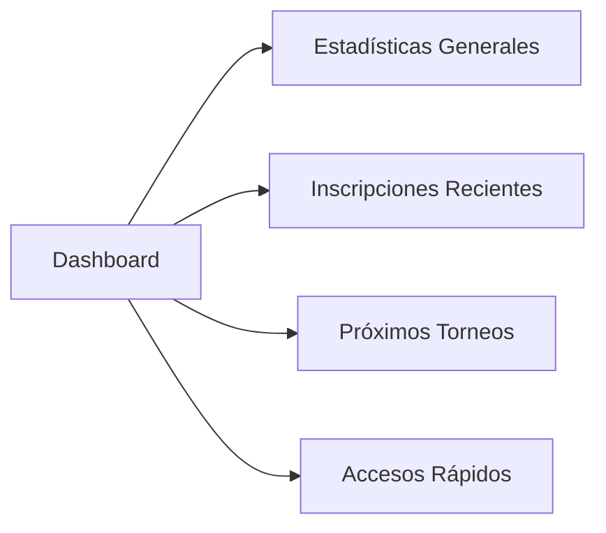
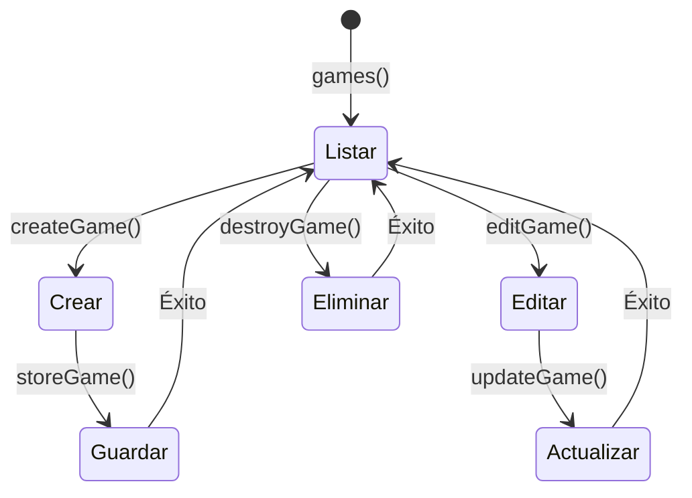
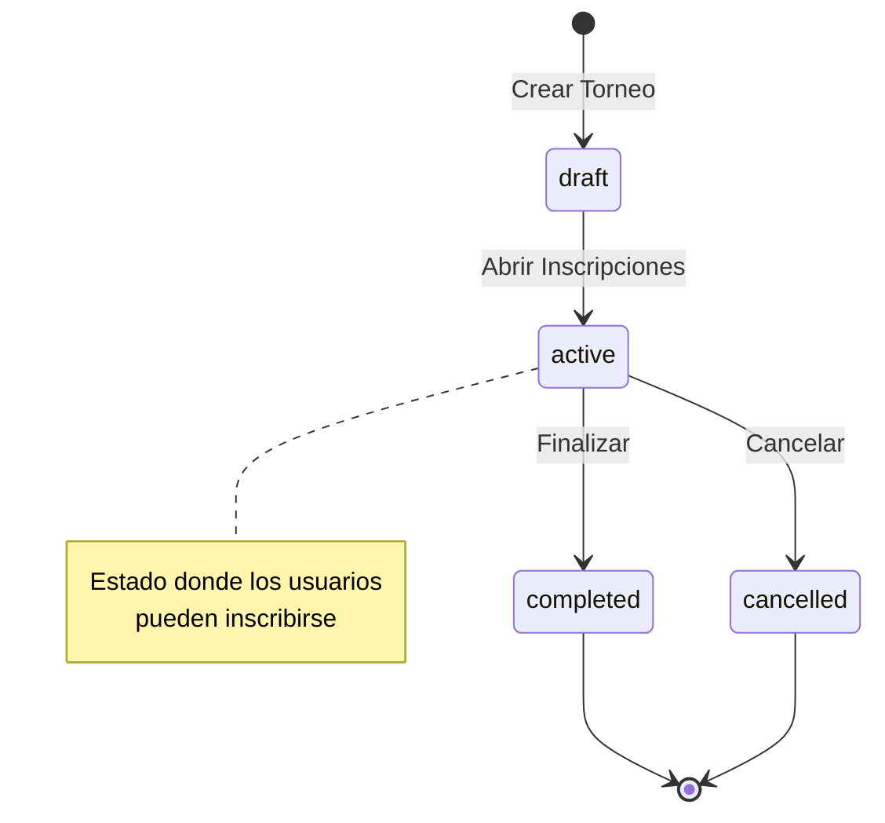
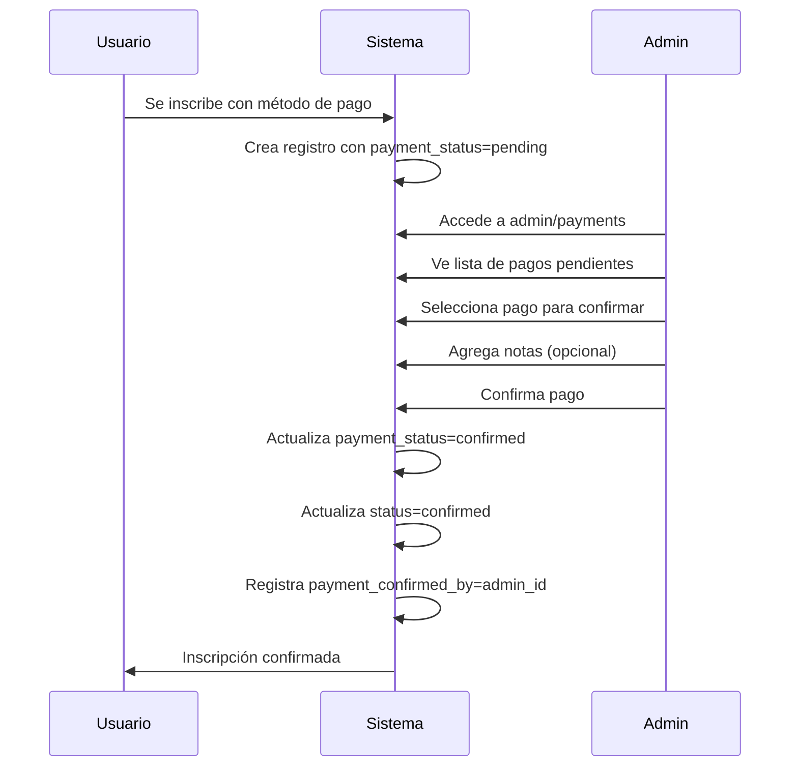
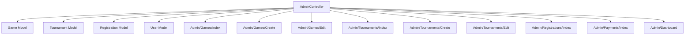

# 👨‍💼 AdminController

**Controlador principal para la gestión administrativa de la plataforma**

---

## 📋 Descripción General

El `AdminController` es el núcleo del sistema administrativo de Vulca Torneos. Maneja todas las operaciones CRUD para juegos, torneos, inscripciones y pagos. Solo accesible para usuarios con rol de administrador.

### 🔐 Seguridad
- **Middleware**: `auth`, `verified`
- **Validación**: Todos los métodos verifican `isAdmin()`
- **Protección**: Abort 403 si no es administrador

---

## 🎯 Métodos Principales

### 📊 Dashboard y Estadísticas

#### `index()`
```php
public function index(): \Inertia\Response
```
**Propósito**: Muestra el dashboard principal con estadísticas
**Retorna**: Vista `Admin/Dashboard` con métricas del sistema

**Datos incluidos**:
- Total de usuarios, juegos, torneos
- Torneos activos y inscripciones pendientes
- Últimas 10 inscripciones
- Próximos 5 torneos



---

## 🎮 Gestión de Juegos

### Flujo CRUD Completo



#### `games()`
- **Propósito**: Lista todos los juegos con contadores
- **Incluye**: Conteo de torneos totales y activos
- **Vista**: `Admin/Games/Index`

#### `createGame()`
- **Propósito**: Muestra formulario de creación
- **Vista**: `Admin/Games/Create`

#### `storeGame(Request $request)`
- **Validaciones**:
  - `name`: requerido, string, máx 255 caracteres
  - `description`: opcional, string
  - `image`: opcional, URL válida
- **Funcionalidad**: Genera slug automáticamente

#### `editGame(Game $game)`
- **Propósito**: Formulario de edición prellenado
- **Vista**: `Admin/Games/Edit`

#### `updateGame(Request $request, Game $game)`
- **Validaciones**: Mismas que storeGame()
- **Funcionalidad**: Actualiza slug si cambia el nombre

#### `destroyGame(Game $game)`
- **Validación**: No permite eliminar si tiene torneos asociados
- **Mensaje**: Error informativo si tiene dependencias

---

## 🏆 Gestión de Torneos

### Flujo de Estados



#### `tournaments()`
- **Propósito**: Lista todos los torneos
- **Incluye**: Información del juego y conteo de inscripciones
- **Orden**: Por fecha de inicio (más recientes primero)

#### `createTournament()`
- **Propósito**: Formulario de creación de torneo
- **Incluye**: Lista de juegos disponibles
- **Vista**: `Admin/Tournaments/Create`

#### `storeTournament(Request $request)`
**Validaciones completas**:
```php
'name' => 'required|string|max:255',
'description' => 'nullable|string',
'game_id' => 'required|exists:games,id',
'start_date' => 'required|date|after:now',
'end_date' => 'required|date|after:start_date',
'max_participants' => 'required|integer|min:1',
'entry_fee' => 'required|numeric|min:0',
'status' => 'required|in:draft,active,completed,cancelled'
```

#### Estados de Torneo
- **draft**: Borrador, no visible públicamente
- **active**: Activo, permite inscripciones
- **completed**: Finalizado
- **cancelled**: Cancelado

---

## 📝 Gestión de Inscripciones

#### `registrations()`
- **Propósito**: Lista todas las inscripciones del sistema
- **Incluye**: Usuario, torneo, juego asociado
- **Orden**: Por fecha de creación (más recientes)

#### `updateRegistration(Request $request, Registration $registration)`
- **Estados permitidos**: `pending`, `confirmed`, `cancelled`
- **Funcionalidad**: Cambio de estado de inscripción

#### `destroyRegistration(Registration $registration)`
- **Propósito**: Eliminación de inscripción
- **Uso**: Para casos excepcionales

---

## 💳 Gestión de Pagos

### Flujo de Confirmación de Pagos



#### `payments(Request $request)`
**Filtros disponibles**:
- `game_id`: Filtrar por juego específico
- `tournament_id`: Filtrar por torneo específico
- `payment_method`: Filtrar por método de pago

**Funcionalidad**:
- Solo muestra pagos con `payment_status = 'pending'`
- Paginación de 20 registros
- Incluye relaciones: usuario, torneo, juego, admin confirmador

#### `confirmPayment(Request $request, Registration $registration)`
**Proceso**:
1. Valida `payment_notes` (opcional)
2. Actualiza notas del pago
3. Llama a `$registration->confirmPayment(auth()->id())`
4. Actualiza estados automáticamente

**Método del modelo Registration**:
```php
public function confirmPayment($confirmedBy = null)
{
    $this->update([
        'payment_status' => self::PAYMENT_CONFIRMED,
        'payment_confirmed_at' => now(),
        'payment_confirmed_by' => $confirmedBy ?: auth()->id(),
        'status' => self::STATUS_CONFIRMED,
    ]);
}
```

---

## 🔒 Middleware y Seguridad

### Validación de Administrador
Todos los métodos incluyen esta validación:
```php
if (!auth()->user()->isAdmin()) {
    abort(403, 'Acceso denegado. Solo administradores.');
}
```

### Rutas Protegidas
```php
Route::middleware(['auth', 'verified'])
    ->prefix('admin')
    ->name('admin.')
    ->group(function () {
        // Todas las rutas administrativas
    });
```

---

## 📊 Estadísticas y Métricas

### Dashboard Stats
```php
$stats = [
    'total_users' => User::count(),
    'total_games' => Game::count(),
    'total_tournaments' => Tournament::count(),
    'total_registrations' => Registration::count(),
    'active_tournaments' => Tournament::where('status', 'active')->count(),
    'pending_registrations' => Registration::where('status', 'pending')->count(),
];
```

### Datos para Dashboard
- **Inscripciones recientes**: Últimas 10 con relaciones cargadas
- **Próximos torneos**: 5 próximos por fecha de inicio
- **Contadores en tiempo real**: Actualizados en cada carga

---

## 🎨 Vistas Asociadas

| Método | Vista | Propósito |
|--------|-------|-----------|
| `index()` | `Admin/Dashboard` | Panel principal |
| `games()` | `Admin/Games/Index` | Lista de juegos |
| `createGame()` | `Admin/Games/Create` | Crear juego |
| `editGame()` | `Admin/Games/Edit` | Editar juego |
| `tournaments()` | `Admin/Tournaments/Index` | Lista de torneos |
| `createTournament()` | `Admin/Tournaments/Create` | Crear torneo |
| `editTournament()` | `Admin/Tournaments/Edit` | Editar torneo |
| `registrations()` | `Admin/Registrations/Index` | Lista inscripciones |
| `payments()` | `Admin/Payments/Index` | Gestión de pagos |

---

## 🚨 Validaciones y Errores

### Eliminación de Juegos
```php
if ($game->tournaments()->count() > 0) {
    return back()->with('error', 'No se puede eliminar el juego porque tiene torneos asociados.');
}
```

### Eliminación de Torneos
```php
if ($tournament->registrations()->count() > 0) {
    return back()->with('error', 'No se puede eliminar el torneo porque tiene inscripciones.');
}
```

### Mensajes de Éxito
- Creación: "Juego/Torneo creado correctamente."
- Actualización: "Juego/Torneo actualizado correctamente."
- Eliminación: "Juego/Torneo eliminado correctamente."
- Pago confirmado: "Pago confirmado correctamente."

---

## 🔄 Relaciones con Otros Componentes



---

*Documentación del AdminController - Vulca Torneos*
*Última actualización: 3 de Julio, 2025*
