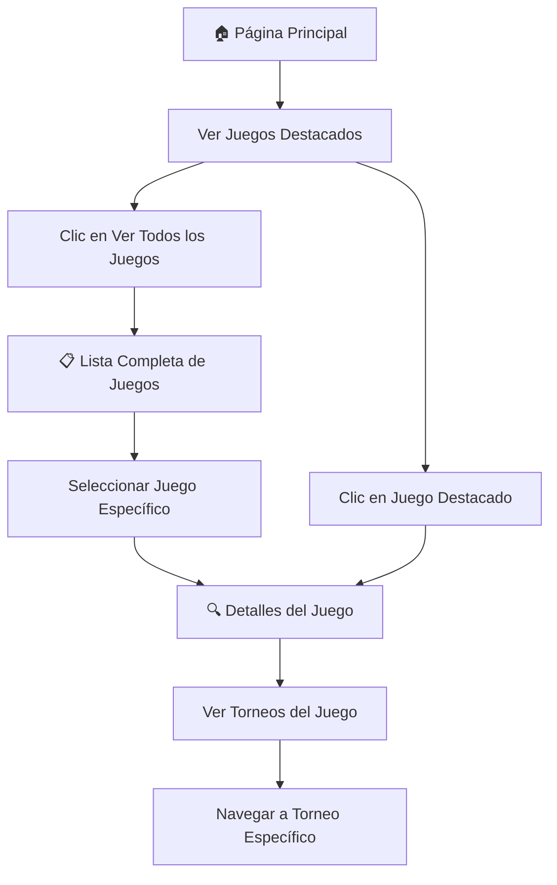
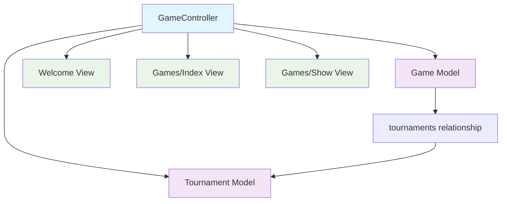

# 🎮 GameController

**Controlador para la gestión pública de juegos**

---

## 📋 Información General

| Atributo | Valor |
|----------|-------|
| **Namespace** | `App\Http\Controllers` |
| **Ruta del archivo** | `app/Http/Controllers/GameController.php` |
| **Tipo** | Controlador Público |
| **Autenticación** | No requerida |

---

## 🎯 Propósito

El `GameController` gestiona todas las operaciones públicas relacionadas con los juegos TCG. Permite a los usuarios (sin necesidad de autenticación) visualizar todos los juegos disponibles, ver detalles específicos de cada juego, y navegar desde la página principal.

---

## 🛠️ Métodos del Controlador

### 🏠 `welcome()`
**Página principal de la aplicación**

```mermaid
graph LR
    A[👤 Usuario] --> B[welcome/]
    B --> C[GameController@welcome]
    C --> D[Obtener juegos destacados]
    D --> E[Renderizar Welcome]
    E --> F[🏠 Página Principal]
```

**Funcionalidad:**
- Obtiene juegos destacados para mostrar en la página principal
- Renderiza la vista welcome con los juegos más populares
- Punto de entrada principal de la aplicación

**Código:**
```php
public function welcome()
{
    $featuredGames = Game::withCount('tournaments')
        ->orderBy('tournaments_count', 'desc')
        ->limit(6)
        ->get();

    return Inertia::render('Welcome', [
        'featuredGames' => $featuredGames
    ]);
}
```

### 📋 `index()`
**Listado completo de juegos**

```mermaid
graph LR
    A[👤 Usuario] --> B[games/]
    B --> C[GameController@index]
    C --> D[Obtener todos los juegos]
    D --> E[Contar torneos por juego]
    E --> F[📋 Lista de Juegos]
```

**Funcionalidad:**
- Lista todos los juegos disponibles
- Incluye el conteo de torneos por juego
- Ordenados por popularidad (más torneos primero)

**Código:**
```php
public function index()
{
    $games = Game::withCount('tournaments')
        ->orderBy('tournaments_count', 'desc')
        ->get();

    return Inertia::render('Games/Index', [
        'games' => $games
    ]);
}
```

### 🔍 `show(Game $game)`
**Detalles específicos de un juego**

```mermaid
graph LR
    A[👤 Usuario] --> B[games/{id}]
    B --> C[GameController@show]
    C --> D[Obtener detalles del juego]
    D --> E[Obtener torneos relacionados]
    E --> F[🔍 Detalles del Juego]
```

**Funcionalidad:**
- Muestra información detallada del juego seleccionado
- Lista todos los torneos disponibles para ese juego
- Incluye información de inscripciones y fechas

**Código:**
```php
public function show(Game $game)
{
    $tournaments = Tournament::where('game_id', $game->id)
        ->withCount('registrations')
        ->orderBy('tournament_date', 'asc')
        ->get();

    return Inertia::render('Games/Show', [
        'game' => $game,
        'tournaments' => $tournaments
    ]);
}
```

---

## 🔄 Flujo de Navegación



---

## 🎨 Vistas Relacionadas

| Vista | Descripción | Ruta |
|-------|-------------|------|
| **Welcome** | Página principal con juegos destacados | `resources/js/pages/Welcome.tsx` |
| **Games/Index** | Lista completa de juegos | `resources/js/pages/Games/Index.tsx` |
| **Games/Show** | Detalles específicos de un juego | `resources/js/pages/Games/Show.tsx` |

---

## 📊 Datos Utilizados

### 🎮 Game Model
- **id**: Identificador único
- **name**: Nombre del juego
- **description**: Descripción del juego
- **image**: URL de la imagen
- **tournaments_count**: Número de torneos (computed)

### 🏆 Tournament Model (relacionado)
- **tournament_date**: Fecha del torneo
- **registrations_count**: Número de inscripciones

---

## 🔗 Relaciones con Otros Componentes



---

## 🛣️ Rutas Asociadas

| Método | Ruta | Nombre | Descripción |
|--------|------|--------|-------------|
| **GET** | `/` | `welcome` | Página principal |
| **GET** | `/games` | `games.index` | Lista de juegos |
| **GET** | `/games/{game}` | `games.show` | Detalles del juego |

---

## 📝 Notas Importantes

> **💡 Tip**: El GameController es completamente público y no requiere autenticación, lo que permite a cualquier usuario explorar los juegos disponibles.

> **🔍 Optimización**: Se utiliza `withCount()` para optimizar las consultas y evitar el problema N+1.

> **📈 Ordenamiento**: Los juegos se ordenan por popularidad (número de torneos) para mostrar primero los más activos.

---

## 🔗 Enlaces Relacionados

- [[AdminController]] - Gestión administrativa de juegos
- [[TournamentController]] - Gestión de torneos
- [[Game Model]] - Modelo de datos de juegos
- [[Rutas Públicas]] - Rutas sin autenticación
