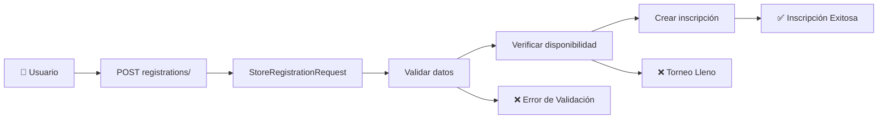
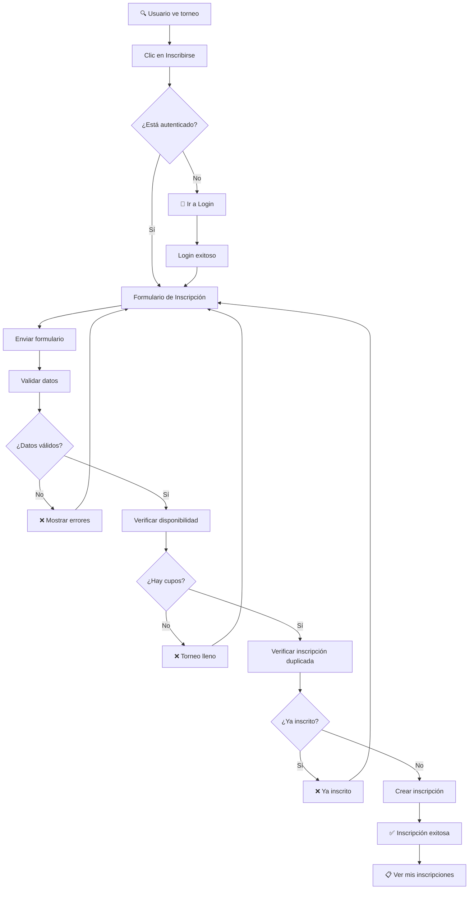
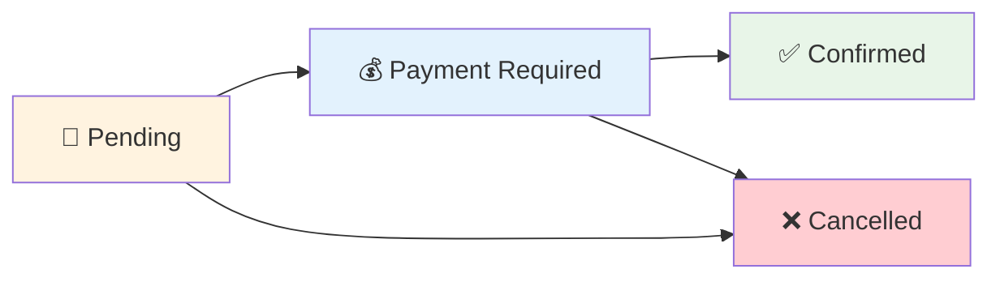
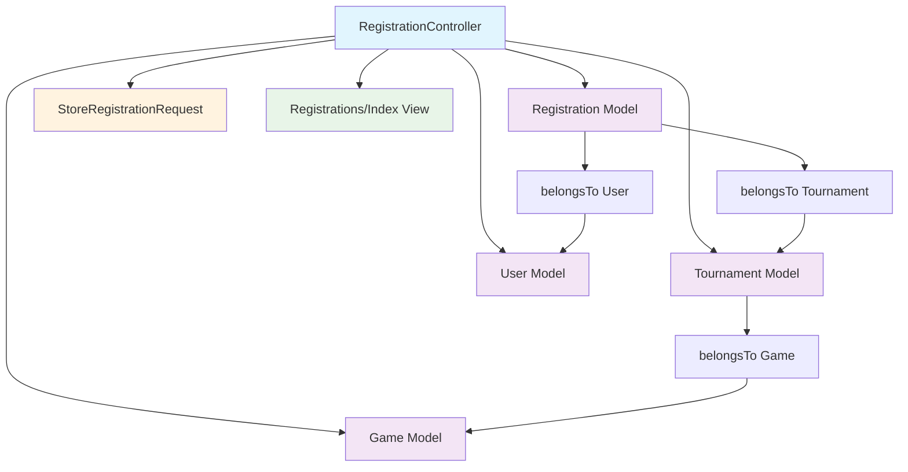

# 📝 RegistrationController

**Controlador para la gestión de inscripciones de usuarios**

---

## 📋 Información General

| Atributo | Valor |
|----------|-------|
| **Namespace** | `App\Http\Controllers` |
| **Ruta del archivo** | `app/Http/Controllers/RegistrationController.php` |
| **Tipo** | Controlador Autenticado |
| **Autenticación** | Requerida |

---

## 🎯 Propósito

El `RegistrationController` gestiona todas las operaciones relacionadas con las inscripciones de usuarios a torneos. Permite a los usuarios autenticados ver sus inscripciones, crear nuevas inscripciones, y gestionar el estado de sus participaciones en torneos.

---

## 🛠️ Métodos del Controlador

### 📋 `index()`
**Listado de inscripciones del usuario**

```mermaid
graph LR
    A[🔐 Usuario Autenticado] --> B[registrations/]
    B --> C[RegistrationController@index]
    C --> D[Obtener inscripciones del usuario]
    D --> E[Cargar torneos y juegos]
    E --> F[📋 Mis Inscripciones]
```

**Funcionalidad:**
- Lista todas las inscripciones del usuario autenticado
- Incluye información del torneo y juego relacionado
- Muestra el estado de cada inscripción
- Ordenadas por fecha de torneo

**Código:**
```php
public function index()
{
    $registrations = Registration::where('user_id', auth()->id())
        ->with(['tournament.game'])
        ->orderBy('created_at', 'desc')
        ->get();

    return Inertia::render('Registrations/Index', [
        'registrations' => $registrations
    ]);
}
```

### 💾 `store(StoreRegistrationRequest $request)`
**Crear nueva inscripción**



**Funcionalidad:**
- Valida los datos de inscripción mediante `StoreRegistrationRequest`
- Verifica que el torneo tenga cupos disponibles
- Previene inscripciones duplicadas
- Crea la inscripción con estado 'pending'

**Código:**
```php
public function store(StoreRegistrationRequest $request)
{
    $tournament = Tournament::findOrFail($request->tournament_id);
    
    // Verificar si el torneo está lleno
    if ($tournament->registrations()->count() >= $tournament->max_participants) {
        return back()->with('error', 'El torneo está lleno');
    }
    
    // Verificar si ya está inscrito
    if ($tournament->registrations()->where('user_id', auth()->id())->exists()) {
        return back()->with('error', 'Ya estás inscrito en este torneo');
    }
    
    Registration::create([
        'user_id' => auth()->id(),
        'tournament_id' => $request->tournament_id,
        'status' => 'pending'
    ]);
    
    return redirect()->route('registrations.index')
        ->with('success', 'Inscripción realizada exitosamente');
}
```

### 🗑️ `destroy(Registration $registration)`
**Cancelar inscripción**

```mermaid
graph LR
    A[🔐 Usuario] --> B[DELETE registrations/{id}]
    B --> C[Verificar propiedad]
    C --> D[Verificar plazo]
    D --> E[Eliminar inscripción]
    E --> F[✅ Cancelación Exitosa]
    
    C --> G[❌ No Autorizado]
    D --> H[❌ Plazo Vencido]
```

**Funcionalidad:**
- Verifica que el usuario sea propietario de la inscripción
- Valida que esté dentro del plazo de cancelación
- Elimina la inscripción de la base de datos
- Libera el cupo para otros usuarios

**Código:**
```php
public function destroy(Registration $registration)
{
    // Verificar que el usuario sea el propietario
    if ($registration->user_id !== auth()->id()) {
        abort(403, 'No autorizado');
    }
    
    // Verificar plazo de cancelación
    if ($registration->tournament->registration_deadline < now()) {
        return back()->with('error', 'No puedes cancelar después del plazo límite');
    }
    
    $registration->delete();
    
    return redirect()->route('registrations.index')
        ->with('success', 'Inscripción cancelada exitosamente');
}
```

---

## 🔄 Flujo de Inscripción



---

## 🎨 Vistas Relacionadas

| Vista | Descripción | Ruta |
|-------|-------------|------|
| **Registrations/Index** | Lista de inscripciones del usuario | `resources/js/pages/Registrations/Index.tsx` |

---

## 📊 Estados de Inscripción



| Estado | Descripción | Color |
|--------|-------------|-------|
| **pending** | Inscripción creada, esperando pago | 🟡 Amarillo |
| **payment_required** | Pago requerido para confirmar | 🔵 Azul |
| **confirmed** | Inscripción confirmada | 🟢 Verde |
| **cancelled** | Inscripción cancelada | 🔴 Rojo |

---

## 🔗 Relaciones con Otros Componentes



---

## 🛣️ Rutas Asociadas

| Método | Ruta | Nombre | Descripción |
|--------|------|--------|-------------|
| **GET** | `/registrations` | `registrations.index` | Lista de inscripciones |
| **POST** | `/registrations` | `registrations.store` | Crear inscripción |
| **DELETE** | `/registrations/{registration}` | `registrations.destroy` | Cancelar inscripción |

---

## 🔒 Validaciones y Seguridad

### 📝 StoreRegistrationRequest
```php
public function rules()
{
    return [
        'tournament_id' => ['required', 'exists:tournaments,id'],
    ];
}
```

### 🛡️ Verificaciones de Seguridad
1. **Autenticación requerida**: Solo usuarios autenticados pueden inscribirse
2. **Propiedad de inscripción**: Solo el propietario puede cancelar su inscripción
3. **Verificación de cupos**: Previene inscripciones cuando el torneo está lleno
4. **Prevención de duplicados**: Un usuario no puede inscribirse dos veces al mismo torneo
5. **Plazo de cancelación**: Respeta los plazos límite de cancelación

---

## 📊 Datos Utilizados

### 📝 Registration Model
- **id**: Identificador único
- **user_id**: ID del usuario inscrito
- **tournament_id**: ID del torneo
- **status**: Estado de la inscripción
- **payment_status**: Estado del pago
- **payment_confirmed_at**: Fecha de confirmación de pago
- **created_at**: Fecha de inscripción

### 🏆 Tournament Model (relacionado)
- **name**: Nombre del torneo
- **tournament_date**: Fecha del torneo
- **registration_deadline**: Fecha límite de inscripción
- **max_participants**: Máximo de participantes
- **entry_fee**: Costo de inscripción

### 🎮 Game Model (relacionado)
- **name**: Nombre del juego
- **image**: Imagen del juego

---

## 🎯 Características Especiales

### 🔄 Optimización de Consultas
```php
// Eager loading para evitar consultas N+1
$registrations = Registration::where('user_id', auth()->id())
    ->with(['tournament.game'])
    ->orderBy('created_at', 'desc')
    ->get();
```

### 🚫 Prevención de Duplicados
```php
// Verificación a nivel de aplicación
if ($tournament->registrations()->where('user_id', auth()->id())->exists()) {
    return back()->with('error', 'Ya estás inscrito en este torneo');
}
```

### 📅 Verificación de Plazos
```php
// Verificación del plazo de cancelación
if ($registration->tournament->registration_deadline < now()) {
    return back()->with('error', 'No puedes cancelar después del plazo límite');
}
```

---

## 💡 Consideraciones de UX

> **🔍 Transparencia**: El usuario ve claramente el estado de todas sus inscripciones.

> **⚡ Feedback Inmediato**: Mensajes claros de éxito y error en cada acción.

> **🛡️ Validaciones Claras**: Mensajes de error específicos para cada caso.

> **📱 Experiencia Mobile**: Diseño responsive para acceso desde cualquier dispositivo.

---

## 🔗 Interacciones con Otros Controladores

```mermaid
graph TB
    A[TournamentController] --> B[Mostrar botón Inscribirse]
    B --> C[RegistrationController@store]
    
    D[AdminController] --> E[Gestionar Inscripciones]
    E --> F[Ver todas las inscripciones]
    F --> G[Confirmar pagos]
    
    H[RegistrationController] --> I[Mis Inscripciones]
    I --> J[Cancelar inscripciones]
    
    style A fill:#e1f5fe
    style C fill:#f3e5f5
    style D fill:#ffcdd2
    style H fill:#fff3e0
```

---

## 📝 Notas Importantes

> **💡 Tip**: Las inscripciones se crean con estado 'pending' y requieren confirmación de pago.

> **🔍 Seguridad**: Múltiples capas de validación para prevenir inscripciones inválidas.

> **⏰ Plazos**: Respeta los plazos de inscripción y cancelación establecidos en cada torneo.

> **🎯 Experiencia**: Flujo simple y directo para facilitar las inscripciones.

---

## 🔗 Enlaces Relacionados

- [[AdminController]] - Gestión administrativa de inscripciones
- [[TournamentController]] - Visualización de torneos
- [[StoreRegistrationRequest]] - Validaciones de inscripción
- [[Registration Model]] - Modelo de datos de inscripciones
- [[Rutas Autenticadas]] - Rutas que requieren login
