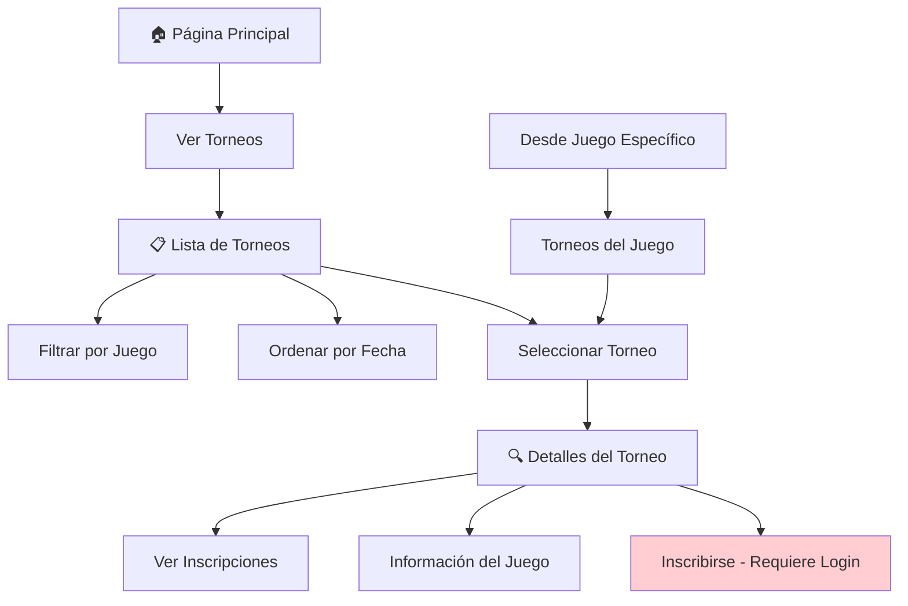
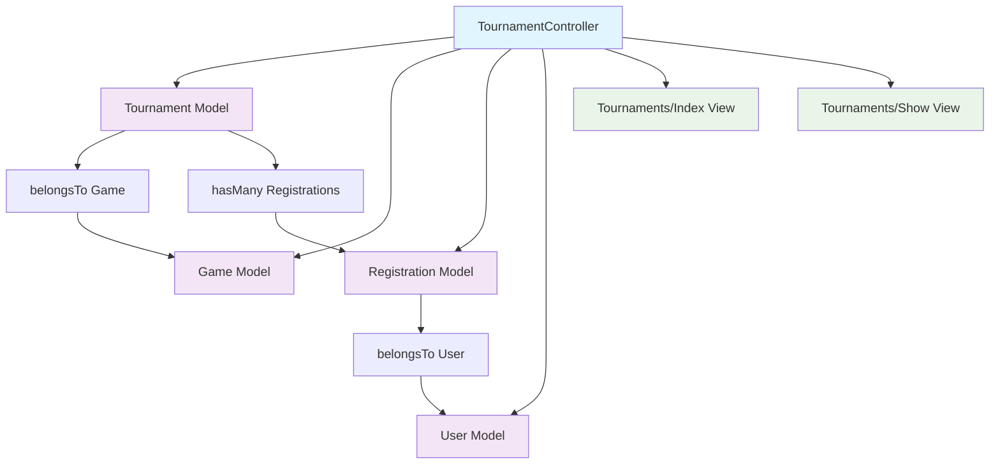
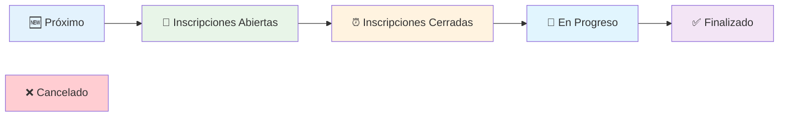
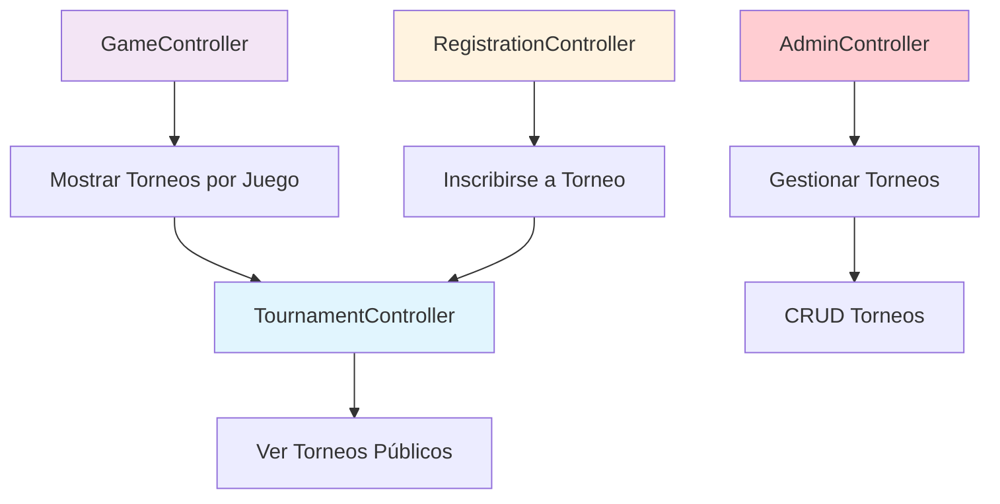

# 🏆 TournamentController

**Controlador para la gestión pública de torneos**

---

## 📋 Información General

| Atributo | Valor |
|----------|-------|
| **Namespace** | `App\Http\Controllers` |
| **Ruta del archivo** | `app/Http/Controllers/TournamentController.php` |
| **Tipo** | Controlador Público |
| **Autenticación** | No requerida |

---

## 🎯 Propósito

El `TournamentController` gestiona todas las operaciones públicas relacionadas con los torneos. Permite a los usuarios (sin necesidad de autenticación) visualizar todos los torneos disponibles, ver detalles específicos de cada torneo, y explorar información como fechas, inscripciones y juegos relacionados.

---

## 🛠️ Métodos del Controlador

### 📋 `index()`
**Listado completo de torneos**

```mermaid
graph LR
    A[👤 Usuario] --> B[tournaments/]
    B --> C[TournamentController@index]
    C --> D[Obtener todos los torneos]
    D --> E[Cargar juegos relacionados]
    E --> F[Contar inscripciones]
    F --> G[📋 Lista de Torneos]
```

**Funcionalidad:**
- Lista todos los torneos disponibles
- Incluye información del juego relacionado
- Muestra el conteo de inscripciones actuales
- Ordenados por fecha de torneo (próximos primero)

**Código:**
```php
public function index()
{
    $tournaments = Tournament::with(['game'])
        ->withCount('registrations')
        ->orderBy('tournament_date', 'asc')
        ->get();

    return Inertia::render('Tournaments/Index', [
        'tournaments' => $tournaments
    ]);
}
```

### 🔍 `show(Tournament $tournament)`
**Detalles específicos de un torneo**

```mermaid
graph LR
    A[👤 Usuario] --> B[tournaments/{id}]
    B --> C[TournamentController@show]
    C --> D[Obtener detalles del torneo]
    D --> E[Cargar juego relacionado]
    E --> F[Obtener inscripciones]
    F --> G[🔍 Detalles del Torneo]
```

**Funcionalidad:**
- Muestra información detallada del torneo seleccionado
- Incluye información del juego relacionado
- Lista todas las inscripciones confirmadas
- Muestra información de fechas y capacidad

**Código:**
```php
public function show(Tournament $tournament)
{
    $tournament->load(['game', 'registrations.user']);

    return Inertia::render('Tournaments/Show', [
        'tournament' => $tournament
    ]);
}
```

---

## 🔄 Flujo de Navegación



---

## 🎨 Vistas Relacionadas

| Vista | Descripción | Ruta |
|-------|-------------|------|
| **Tournaments/Index** | Lista completa de torneos | `resources/js/pages/Tournaments/Index.tsx` |
| **Tournaments/Show** | Detalles específicos de un torneo | `resources/js/pages/Tournaments/Show.tsx` |

---

## 📊 Datos Utilizados

### 🏆 Tournament Model
- **id**: Identificador único
- **name**: Nombre del torneo
- **description**: Descripción del torneo
- **game_id**: ID del juego relacionado
- **tournament_date**: Fecha y hora del torneo
- **registration_deadline**: Fecha límite de inscripción
- **max_participants**: Máximo de participantes
- **entry_fee**: Costo de inscripción
- **registrations_count**: Número de inscripciones (computed)

### 🎮 Game Model (relacionado)
- **name**: Nombre del juego
- **description**: Descripción del juego
- **image**: URL de la imagen

### 📝 Registration Model (relacionado)
- **user_id**: ID del usuario inscrito
- **tournament_id**: ID del torneo
- **status**: Estado de la inscripción

---

## 🔗 Relaciones con Otros Componentes



---

## 🛣️ Rutas Asociadas

| Método | Ruta | Nombre | Descripción |
|--------|------|--------|-------------|
| **GET** | `/tournaments` | `tournaments.index` | Lista de torneos |
| **GET** | `/tournaments/{tournament}` | `tournaments.show` | Detalles del torneo |

---

## 📅 Estados de Torneos



---

## 🔍 Información Mostrada

### 📋 En Lista de Torneos
- **Nombre del torneo**
- **Juego relacionado**
- **Fecha del torneo**
- **Fecha límite de inscripción**
- **Participantes actuales / máximo**
- **Costo de inscripción**
- **Estado del torneo**

### 🔍 En Detalles del Torneo
- **Toda la información anterior**
- **Descripción completa**
- **Lista de participantes inscritos**
- **Información detallada del juego**
- **Botón de inscripción (si el usuario está autenticado)**

---

## 🚀 Características Especiales

### 🔄 Eager Loading
```php
// Optimización para evitar consultas N+1
$tournaments = Tournament::with(['game'])
    ->withCount('registrations')
    ->orderBy('tournament_date', 'asc')
    ->get();
```

### 📊 Conteo de Inscripciones
```php
// Incluye el conteo de inscripciones sin cargar todas las relaciones
->withCount('registrations')
```

### 🎯 Ordenamiento Inteligente
```php
// Próximos torneos primero
->orderBy('tournament_date', 'asc')
```

---

## 💡 Consideraciones de UX

> **🔍 Exploración Sin Barreras**: Los usuarios pueden explorar todos los torneos sin necesidad de registro.

> **📅 Información Clara**: Fechas y estados claramente visibles para facilitar la decisión de inscripción.

> **🎮 Contexto del Juego**: Información del juego siempre visible para proporcionar contexto.

> **👥 Transparencia**: Número de participantes actuales visible para mostrar popularidad.

---

## 🔗 Interacciones con Otros Controladores



---

## 📝 Notas Importantes

> **💡 Tip**: El TournamentController es completamente público, pero la inscripción requiere autenticación.

> **🔍 Optimización**: Se utiliza `with()` y `withCount()` para optimizar las consultas.

> **📈 Ordenamiento**: Los torneos se ordenan por fecha para mostrar primero los más próximos.

> **🔒 Seguridad**: Aunque es público, solo se muestran datos necesarios para la visualización.

---

## 🔗 Enlaces Relacionados

- [[AdminController]] - Gestión administrativa de torneos
- [[GameController]] - Gestión de juegos
- [[RegistrationController]] - Gestión de inscripciones
- [[Tournament Model]] - Modelo de datos de torneos
- [[Rutas Públicas]] - Rutas sin autenticación
