# 🗄️ Base de Datos y Migraciones

**Documentación completa del esquema de base de datos**

---

## 📋 Información General

| Atributo | Valor |
|----------|-------|
| **Motor de BD** | SQLite (desarrollo), MySQL/PostgreSQL (producción) |
| **Ruta de migraciones** | `database/migrations/` |
| **Archivo de BD** | `database/database.sqlite` |
| **ORM** | Eloquent |

---

## 🎯 Diagrama General de la Base de Datos


---

## 📁 Migraciones por Orden Cronológico

### 1. 🔐 Tabla Users (Base de Laravel)
**Archivo:** `0001_01_01_000000_create_users_table.php`

```sql
CREATE TABLE users (
    id BIGINT PRIMARY KEY AUTO_INCREMENT,
    name VARCHAR(255) NOT NULL,
    email VARCHAR(255) UNIQUE NOT NULL,
    email_verified_at TIMESTAMP NULL,
    password VARCHAR(255) NOT NULL,
    remember_token VARCHAR(100) NULL,
    created_at TIMESTAMP NULL,
    updated_at TIMESTAMP NULL
);
```

### 2. 📦 Tabla Cache (Base de Laravel)
**Archivo:** `0001_01_01_000001_create_cache_table.php`

```sql
CREATE TABLE cache (
    key VARCHAR(255) PRIMARY KEY,
    value MEDIUMTEXT NOT NULL,
    expiration INT NOT NULL
);

CREATE TABLE cache_locks (
    key VARCHAR(255) PRIMARY KEY,
    owner VARCHAR(255) NOT NULL,
    expiration INT NOT NULL
);
```

### 3. ⚙️ Tabla Jobs (Base de Laravel)
**Archivo:** `0001_01_01_000002_create_jobs_table.php`

```sql
CREATE TABLE jobs (
    id BIGINT PRIMARY KEY AUTO_INCREMENT,
    queue VARCHAR(255) NOT NULL,
    payload LONGTEXT NOT NULL,
    attempts TINYINT UNSIGNED NOT NULL,
    reserved_at INT UNSIGNED NULL,
    available_at INT UNSIGNED NOT NULL,
    created_at INT UNSIGNED NOT NULL
);

CREATE TABLE job_batches (
    id VARCHAR(255) PRIMARY KEY,
    name VARCHAR(255) NOT NULL,
    total_jobs INT NOT NULL,
    pending_jobs INT NOT NULL,
    failed_jobs INT NOT NULL,
    failed_job_ids LONGTEXT NOT NULL,
    options MEDIUMTEXT NULL,
    cancelled_at INT NULL,
    created_at INT NOT NULL,
    finished_at INT NULL
);

CREATE TABLE failed_jobs (
    id BIGINT PRIMARY KEY AUTO_INCREMENT,
    uuid VARCHAR(255) UNIQUE NOT NULL,
    connection TEXT NOT NULL,
    queue TEXT NOT NULL,
    payload LONGTEXT NOT NULL,
    exception LONGTEXT NOT NULL,
    failed_at TIMESTAMP DEFAULT CURRENT_TIMESTAMP
);
```

### 4. 👤 Agregar Role a Users
**Archivo:** `2025_07_03_135217_add_role_to_users_table.php`

```sql
ALTER TABLE users 
ADD COLUMN role VARCHAR(255) NOT NULL DEFAULT 'user';
```

**Funcionalidad:**
- Agrega sistema de roles al modelo User
- Valores posibles: 'user', 'admin'
- Default: 'user' para nuevos usuarios

### 5. 🎮 Tabla Games
**Archivo:** `2025_07_03_135934_create_games_table.php`

```sql
CREATE TABLE games (
    id BIGINT PRIMARY KEY AUTO_INCREMENT,
    name VARCHAR(255) NOT NULL,
    slug VARCHAR(255) UNIQUE NOT NULL,
    description TEXT NULL,
    image VARCHAR(255) NULL,
    created_at TIMESTAMP NULL,
    updated_at TIMESTAMP NULL
);
```

**Funcionalidad:**
- Almacena información de juegos TCG
- Slug único para URLs amigables
- Imagen opcional para representación visual

### 6. 🏆 Tabla Tournaments
**Archivo:** `2025_07_03_143728_create_tournaments_table.php`

```sql
CREATE TABLE tournaments (
    id BIGINT PRIMARY KEY AUTO_INCREMENT,
    name VARCHAR(255) NOT NULL,
    description TEXT NULL,
    game_id BIGINT NOT NULL,
    tournament_date DATETIME NOT NULL,
    registration_deadline DATETIME NOT NULL,
    max_participants INT NOT NULL DEFAULT 50,
    entry_fee DECIMAL(8,2) NOT NULL DEFAULT 0.00,
    status VARCHAR(255) NOT NULL DEFAULT 'active',
    created_at TIMESTAMP NULL,
    updated_at TIMESTAMP NULL,
    
    FOREIGN KEY (game_id) REFERENCES games(id) ON DELETE CASCADE
);
```

**Funcionalidad:**
- Gestiona torneos por juego
- Control de fechas y capacidad
- Sistema de precios y estados

### 7. 📝 Tabla Registrations
**Archivo:** `2025_07_03_151230_create_registrations_table.php`

```sql
CREATE TABLE registrations (
    id BIGINT PRIMARY KEY AUTO_INCREMENT,
    user_id BIGINT NOT NULL,
    tournament_id BIGINT NOT NULL,
    status VARCHAR(255) NOT NULL DEFAULT 'pending',
    created_at TIMESTAMP NULL,
    updated_at TIMESTAMP NULL,
    
    FOREIGN KEY (user_id) REFERENCES users(id) ON DELETE CASCADE,
    FOREIGN KEY (tournament_id) REFERENCES tournaments(id) ON DELETE CASCADE,
    UNIQUE KEY unique_user_tournament (user_id, tournament_id)
);
```

**Funcionalidad:**
- Gestiona inscripciones de usuarios a torneos
- Previene inscripciones duplicadas
- Sistema de estados de inscripción

### 8. 💰 Campos de Pago en Registrations
**Archivo:** `2025_07_03_185946_add_payment_fields_to_registrations_table.php`

```sql
ALTER TABLE registrations 
ADD COLUMN payment_method VARCHAR(255) NOT NULL DEFAULT 'cash',
ADD COLUMN payment_status VARCHAR(255) NOT NULL DEFAULT 'pending',
ADD COLUMN payment_confirmed_at TIMESTAMP NULL;
```

**Funcionalidad:**
- Sistema de gestión de pagos
- Métodos: cash, transfer, card
- Estados: pending, confirmed, failed
- Timestamp de confirmación

---

## 🔗 Relaciones de la Base de Datos

### 📊 Diagrama de Relaciones Detallado


---

## 🔧 Índices y Constraints

### 🔑 Claves Primarias
- Todas las tablas tienen `id` como clave primaria auto-incremental

### 🔗 Claves Foráneas
```sql
-- En tournaments
FOREIGN KEY (game_id) REFERENCES games(id) ON DELETE CASCADE

-- En registrations
FOREIGN KEY (user_id) REFERENCES users(id) ON DELETE CASCADE
FOREIGN KEY (tournament_id) REFERENCES tournaments(id) ON DELETE CASCADE
```

### 🛡️ Constraints Únicos
```sql
-- En users
UNIQUE KEY (email)

-- En games
UNIQUE KEY (slug)

-- En registrations
UNIQUE KEY unique_user_tournament (user_id, tournament_id)
```

### 📊 Índices Recomendados
```sql
-- Para optimizar consultas frecuentes
CREATE INDEX idx_tournaments_game_date ON tournaments(game_id, tournament_date);
CREATE INDEX idx_registrations_status ON registrations(status);
CREATE INDEX idx_registrations_payment ON registrations(payment_status);
CREATE INDEX idx_users_role ON users(role);
```

---

## 📈 Estados y Valores Permitidos

### 👤 User Roles
```php
const ROLE_USER = 'user';
const ROLE_ADMIN = 'admin';
```

### 🏆 Tournament Status
```php
const STATUS_ACTIVE = 'active';
const STATUS_CANCELLED = 'cancelled';
const STATUS_COMPLETED = 'completed';
```

### 📝 Registration Status
```php
const STATUS_PENDING = 'pending';
const STATUS_CONFIRMED = 'confirmed';
const STATUS_CANCELLED = 'cancelled';
```

### 💰 Payment Methods
```php
const PAYMENT_CASH = 'cash';
const PAYMENT_TRANSFER = 'transfer';
const PAYMENT_CARD = 'card';
```

### 💳 Payment Status
```php
const PAYMENT_PENDING = 'pending';
const PAYMENT_CONFIRMED = 'confirmed';
const PAYMENT_FAILED = 'failed';
```

---

## 🔄 Flujo de Estados

### 📝 Estados de Inscripción

```mermaid
graph LR
    A[📝 pending] --> B[✅ confirmed]
    A --> C[❌ cancelled]
    B --> C
    
    D[💰 payment_pending] --> E[💳 payment_confirmed]
    D --> F[❌ payment_failed]
    F --> D
    
    style A fill:#fff3e0
    style B fill:#e8f5e8
    style C fill:#ffcdd2
    style D fill:#e3f2fd
    style E fill:#e8f5e8
    style F fill:#ffcdd2
```



### 🏆 Estados de Torneo

```mermaid
graph LR
    A[🆕 active] --> B[✅ completed]
    A --> C[❌ cancelled]
    
    style A fill:#e8f5e8
    style B fill:#e3f2fd
    style C fill:#ffcdd2
```



---

## 📊 Ejemplos de Consultas

### 🔍 Consultas Básicas

```sql
-- Obtener todos los juegos con conteo de torneos
SELECT g.*, COUNT(t.id) as tournaments_count 
FROM games g 
LEFT JOIN tournaments t ON g.id = t.game_id 
GROUP BY g.id;

-- Obtener torneos activos con inscripciones
SELECT t.*, COUNT(r.id) as registrations_count 
FROM tournaments t 
LEFT JOIN registrations r ON t.id = r.tournament_id 
WHERE t.status = 'active' 
GROUP BY t.id;

-- Obtener inscripciones de un usuario con detalles
SELECT r.*, t.name as tournament_name, g.name as game_name 
FROM registrations r 
JOIN tournaments t ON r.tournament_id = t.id 
JOIN games g ON t.game_id = g.id 
WHERE r.user_id = 1;
```

### 📈 Consultas de Estadísticas

```sql
-- Juegos más populares por número de torneos
SELECT g.name, COUNT(t.id) as total_tournaments 
FROM games g 
LEFT JOIN tournaments t ON g.id = t.game_id 
GROUP BY g.id 
ORDER BY total_tournaments DESC;

-- Usuarios más activos por inscripciones
SELECT u.name, COUNT(r.id) as total_registrations 
FROM users u 
LEFT JOIN registrations r ON u.id = r.user_id 
GROUP BY u.id 
ORDER BY total_registrations DESC;

-- Pagos pendientes de confirmación
SELECT r.*, u.name as user_name, t.name as tournament_name 
FROM registrations r 
JOIN users u ON r.user_id = u.id 
JOIN tournaments t ON r.tournament_id = t.id 
WHERE r.payment_status = 'pending';
```

---

## 🛠️ Comandos de Migración

### ⚡ Comandos Útiles

```bash
# Ejecutar todas las migraciones
php artisan migrate

# Ejecutar migraciones en ambiente fresco
php artisan migrate:fresh

# Ejecutar migraciones con seeders
php artisan migrate:fresh --seed

# Ver estado de migraciones
php artisan migrate:status

# Hacer rollback de última migración
php artisan migrate:rollback

# Hacer rollback de un batch específico
php artisan migrate:rollback --batch=3
```

---

## 🔧 Optimizaciones de Performance

### 📊 Índices Recomendados

```sql
-- Para búsquedas por juego y fecha
CREATE INDEX idx_tournaments_game_date ON tournaments(game_id, tournament_date);

-- Para filtros de estado
CREATE INDEX idx_tournaments_status ON tournaments(status);
CREATE INDEX idx_registrations_status ON registrations(status);
CREATE INDEX idx_registrations_payment_status ON registrations(payment_status);

-- Para búsquedas de usuarios
CREATE INDEX idx_users_role ON users(role);
CREATE INDEX idx_users_email ON users(email);

-- Para búsquedas de juegos
CREATE INDEX idx_games_slug ON games(slug);
```

### 🚀 Estrategias de Optimización

1. **Eager Loading**: Cargar relaciones necesarias
2. **Lazy Loading**: Evitar cargas innecesarias
3. **Índices**: Crear índices para consultas frecuentes
4. **Paginación**: Limitar resultados grandes
5. **Cache**: Cachear consultas pesadas

---

## 💾 Backup y Mantenimiento

### 📁 Estrategia de Backup

```bash
# Backup completo de la base de datos
php artisan db:backup

# Backup solo de estructura
php artisan migrate:install --pretend

# Backup de datos específicos
php artisan db:seed --class=BackupSeeder
```

### 🔧 Mantenimiento Regular

```sql
-- Limpiar registros antiguos
DELETE FROM registrations 
WHERE created_at < DATE_SUB(NOW(), INTERVAL 1 YEAR)
AND status = 'cancelled';

-- Optimizar tablas
OPTIMIZE TABLE users, games, tournaments, registrations;

-- Verificar integridad
CHECK TABLE users, games, tournaments, registrations;
```

---

## 📝 Notas Importantes

> **💡 Tip**: Las migraciones siguen un orden cronológico estricto para mantener la integridad.

> **🔒 Seguridad**: Las claves foráneas con `ON DELETE CASCADE` mantienen la consistencia.

> **⚡ Performance**: Los índices únicos compuestos optimizan las búsquedas más frecuentes.

> **🎯 Escalabilidad**: El esquema está diseñado para soportar crecimiento futuro.

---

## 🔗 Enlaces Relacionados

- [[User Model]] - Modelo de usuarios
- [[Game Model]] - Modelo de juegos
- [[Tournament Model]] - Modelo de torneos
- [[Registration Model]] - Modelo de inscripciones
- [[Seeders]] - Datos de prueba y iniciales
