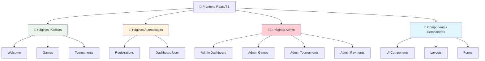
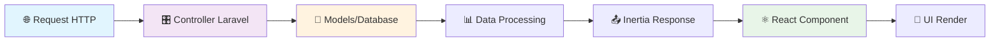
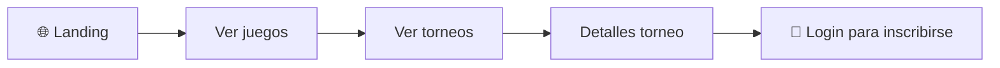
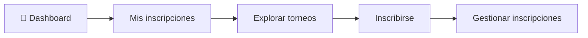
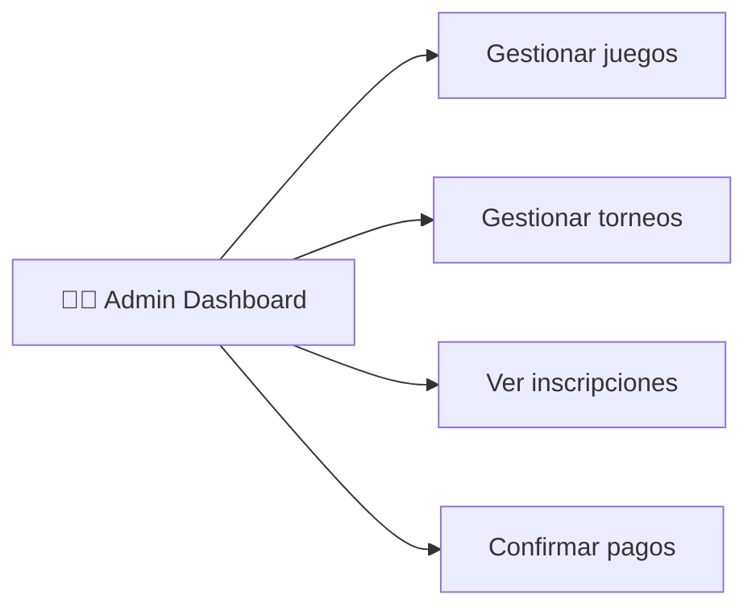
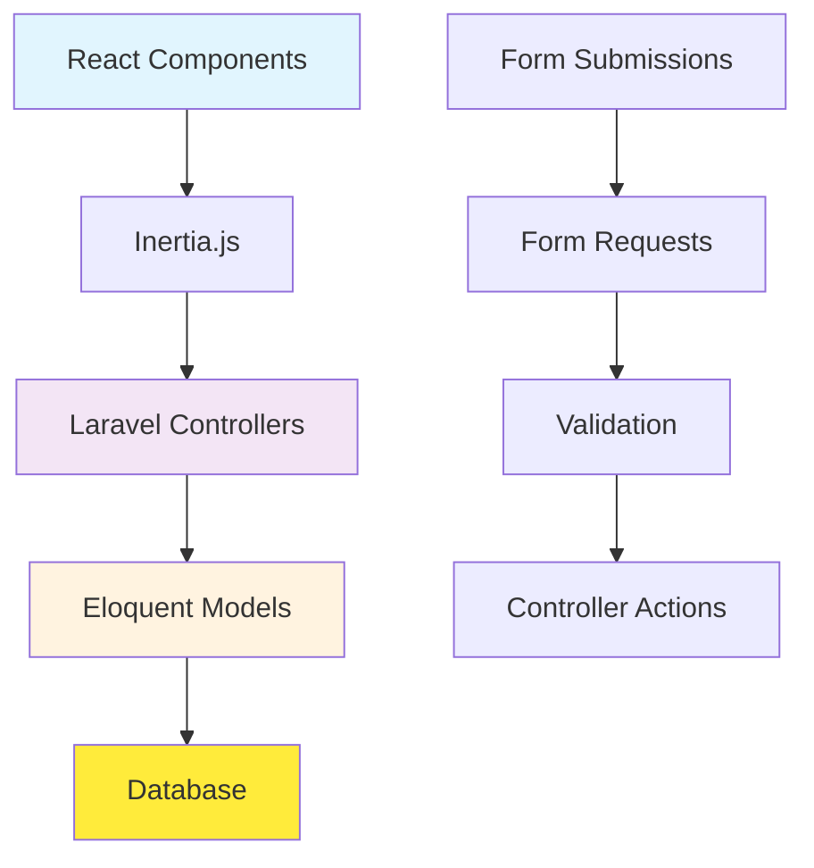

# 🎨 Frontend - Componentes React

**Documentación completa de la interfaz de usuario**

---

## 📋 Información General

| Atributo | Valor |
|----------|-------|
| **Framework** | React 18 + TypeScript |
| **UI Library** | shadcn/ui + Tailwind CSS |
| **Meta Framework** | Inertia.js |
| **Ruta base** | `resources/js/` |
| **Build Tool** | Vite |

---

## 🏗️ Arquitectura del Frontend



---

## 📱 Páginas Públicas

### 🏠 Welcome Page
**Archivo:** `resources/js/pages/welcome.tsx`

```typescript
interface WelcomeProps {
    featuredGames: Game[];
}

interface Game {
    id: number;
    name: string;
    slug: string;
    description: string;
    image: string;
    tournaments_count: number;
}
```

**Funcionalidad:**
- Página principal de la aplicación
- Muestra juegos destacados
- Cards responsive con información básica
- Navegación hacia exploración de juegos

**Componentes utilizados:**
- `Button` (shadcn/ui)
- `Card` (shadcn/ui)
- `Link` (Inertia)

### 🎮 Games Pages

#### Lista de Juegos
**Archivo:** `resources/js/pages/Games/Index.tsx`

```typescript
interface GamesIndexProps {
    games: Game[];
}
```

**Funcionalidad:**
- Grid responsive de juegos
- Conteo de torneos por juego
- Navegación hacia detalles

#### Detalles del Juego
**Archivo:** `resources/js/pages/Games/Show.tsx`

```typescript
interface GamesShowProps {
    game: Game;
    tournaments: Tournament[];
}

interface Tournament {
    id: number;
    name: string;
    description: string;
    tournament_date: string;
    registration_deadline: string;
    max_participants: number;
    entry_fee: number;
    registrations_count: number;
}
```

**Funcionalidad:**
- Información detallada del juego
- Lista de torneos del juego
- Botones de acción hacia inscripción

### 🏆 Tournaments Pages

#### Lista de Torneos
**Archivo:** `resources/js/pages/Tournaments/Index.tsx`

```typescript
interface TournamentsIndexProps {
    tournaments: Tournament[];
}
```

**Funcionalidad:**
- Lista completa de torneos
- Filtros por juego y fecha
- Información de capacidad

#### Detalles del Torneo
**Archivo:** `resources/js/pages/Tournaments/Show.tsx`

```typescript
interface TournamentsShowProps {
    tournament: Tournament & {
        game: Game;
        registrations: Registration[];
    };
}
```

**Funcionalidad:**
- Información completa del torneo
- Lista de participantes
- Formulario de inscripción (si autenticado)

---

## 🔐 Páginas Autenticadas

### 📝 Registrations Page
**Archivo:** `resources/js/pages/Registrations/Index.tsx`

```typescript
interface RegistrationsIndexProps {
    registrations: Registration[];
}

interface Registration {
    id: number;
    status: 'pending' | 'confirmed' | 'cancelled';
    payment_status: 'pending' | 'confirmed' | 'failed';
    payment_method: 'cash' | 'transfer' | 'card';
    tournament: Tournament & {
        game: Game;
    };
    created_at: string;
}
```

**Funcionalidad:**
- Lista de inscripciones del usuario
- Estados visuales con badges
- Acciones de cancelación
- Información de pagos

**Componentes utilizados:**
- `Table` (shadcn/ui)
- `Badge` (shadcn/ui)
- `Button` (shadcn/ui)
- `AlertDialog` (shadcn/ui)

---

## 👨‍💼 Páginas Administrativas

### 📊 Admin Dashboard
**Archivo:** `resources/js/pages/Admin/Dashboard.tsx`

```typescript
interface AdminDashboardProps {
    stats: {
        totalUsers: number;
        totalGames: number;
        totalTournaments: number;
        totalRegistrations: number;
        pendingPayments: number;
    };
    recentRegistrations: Registration[];
    upcomingTournaments: Tournament[];
}
```

**Funcionalidad:**
- Estadísticas generales del sistema
- Inscripciones recientes
- Próximos torneos
- Accesos rápidos a gestión

### 🎮 Admin Games

#### Lista de Juegos Admin
**Archivo:** `resources/js/pages/Admin/Games/Index.tsx`

```typescript
interface AdminGamesIndexProps {
    games: Game[];
}
```

**Funcionalidad:**
- CRUD completo de juegos
- Tabla con acciones
- Búsqueda y filtros

#### Crear/Editar Juego
**Archivos:** 
- `resources/js/pages/Admin/Games/Create.tsx`
- `resources/js/pages/Admin/Games/Edit.tsx`

```typescript
interface GameFormProps {
    game?: Game; // Solo en Edit
}

interface GameFormData {
    name: string;
    description: string;
    image: string;
}
```

**Funcionalidad:**
- Formulario de creación/edición
- Validación en tiempo real
- Preview de imagen
- Generación automática de slug

### 🏆 Admin Tournaments

#### Lista de Torneos Admin
**Archivo:** `resources/js/pages/Admin/Tournaments/Index.tsx`

```typescript
interface AdminTournamentsIndexProps {
    tournaments: Tournament[];
    games: Game[];
}
```

**Funcionalidad:**
- CRUD completo de torneos
- Filtros por juego y estado
- Gestión de capacidad

#### Crear Torneo
**Archivo:** `resources/js/pages/Admin/Tournaments/Create.tsx`

```typescript
interface TournamentFormData {
    name: string;
    description: string;
    game_id: number;
    tournament_date: string;
    registration_deadline: string;
    max_participants: number;
    entry_fee: number;
}
```

**Funcionalidad:**
- Formulario completo de torneo
- Selector de juego
- Validación de fechas
- Configuración de precios

### 💰 Admin Payments
**Archivo:** `resources/js/pages/Admin/Payments/Index.tsx`

```typescript
interface AdminPaymentsProps {
    pendingPayments: Registration[];
}
```

**Funcionalidad:**
- Lista de pagos pendientes
- Filtros avanzados
- Confirmación manual de pagos
- Historial de transacciones

---

## 🧩 Componentes Compartidos

### 📦 UI Components (shadcn/ui)

```typescript
// Componentes principales utilizados
import { Button } from "@/components/ui/button"
import { Card, CardContent, CardHeader, CardTitle } from "@/components/ui/card"
import { Input } from "@/components/ui/input"
import { Label } from "@/components/ui/label"
import { Table, TableBody, TableCell, TableHead, TableHeader, TableRow } from "@/components/ui/table"
import { Badge } from "@/components/ui/badge"
import { AlertDialog, AlertDialogAction, AlertDialogCancel, AlertDialogContent, AlertDialogDescription, AlertDialogFooter, AlertDialogHeader, AlertDialogTitle, AlertDialogTrigger } from "@/components/ui/alert-dialog"
import { Select, SelectContent, SelectItem, SelectTrigger, SelectValue } from "@/components/ui/select"
import { Textarea } from "@/components/ui/textarea"
```

### 🎨 Design System

#### 🎨 Colores por Estado

```css
/* Estados de inscripción */
.status-pending { @apply bg-yellow-100 text-yellow-800; }
.status-confirmed { @apply bg-green-100 text-green-800; }
.status-cancelled { @apply bg-red-100 text-red-800; }

/* Estados de pago */
.payment-pending { @apply bg-blue-100 text-blue-800; }
.payment-confirmed { @apply bg-green-100 text-green-800; }
.payment-failed { @apply bg-red-100 text-red-800; }
```

#### 📱 Responsive Design

```css
/* Grid responsive para cards */
.games-grid {
    @apply grid grid-cols-1 md:grid-cols-2 lg:grid-cols-3 gap-6;
}

/* Tabla responsive */
.responsive-table {
    @apply overflow-x-auto;
}

/* Navegación móvil */
.mobile-nav {
    @apply block md:hidden;
}
```

---

## 🔄 Flujo de Datos con Inertia

### 📊 Diagrama de Flujo



### 📝 Ejemplo de Integración

```typescript
// En el componente React
interface Props {
    games: Game[];
    flash?: {
        success?: string;
        error?: string;
    };
}

export default function GamesIndex({ games, flash }: Props) {
    return (
        <AuthenticatedLayout>
            {flash?.success && (
                <Alert className="mb-4">
                    <AlertDescription>{flash.success}</AlertDescription>
                </Alert>
            )}
            
            <div className="games-grid">
                {games.map(game => (
                    <GameCard key={game.id} game={game} />
                ))}
            </div>
        </AuthenticatedLayout>
    );
}
```

---

## 📱 Layouts

### 🏗️ Authenticated Layout
**Archivo:** `resources/js/layouts/AuthenticatedLayout.tsx`

```typescript
interface AuthenticatedLayoutProps {
    children: React.ReactNode;
    header?: React.ReactNode;
}
```

**Funcionalidad:**
- Layout base para usuarios autenticados
- Navegación principal
- Dropdown de usuario
- Responsive design

### 👨‍💼 Admin Layout
**Archivo:** `resources/js/layouts/AdminLayout.tsx`

```typescript
interface AdminLayoutProps {
    children: React.ReactNode;
    title?: string;
}
```

**Funcionalidad:**
- Layout específico para administradores
- Sidebar de navegación admin
- Breadcrumbs
- Accesos rápidos

---

## 🎯 Casos de Uso por Tipo de Usuario

### 👤 Usuario Anónimo



### 🔐 Usuario Autenticado



### 👨‍💼 Administrador



---

## 🚀 Optimizaciones de Performance

### ⚡ Estrategias Implementadas

1. **Code Splitting**: División automática por rutas
2. **Lazy Loading**: Carga bajo demanda de componentes
3. **Tree Shaking**: Eliminación de código no utilizado
4. **Bundle Optimization**: Optimización de Vite
5. **Image Optimization**: Lazy loading de imágenes

### 📊 Bundle Analysis

```bash
# Analizar el bundle
npm run build
npm run analyze

# Optimizar imágenes
npm run optimize-images
```

---

## 🔧 Herramientas de Desarrollo

### 🛠️ Scripts Disponibles

```json
{
  "scripts": {
    "dev": "vite",
    "build": "vite build",
    "preview": "vite preview",
    "type-check": "tsc --noEmit",
    "lint": "eslint resources/js --ext .ts,.tsx",
    "lint:fix": "eslint resources/js --ext .ts,.tsx --fix"
  }
}
```

### 🔍 Debugging

```typescript
// Debug props en desarrollo
if (import.meta.env.DEV) {
    console.log('Props received:', props);
}

// Error boundaries
class ErrorBoundary extends React.Component {
    componentDidCatch(error: Error, errorInfo: React.ErrorInfo) {
        console.error('Component error:', error, errorInfo);
    }
}
```

---

## 📱 Responsive Design

### 📊 Breakpoints

```css
/* Tailwind CSS breakpoints */
sm: 640px   /* Móvil grande */
md: 768px   /* Tablet */
lg: 1024px  /* Desktop pequeño */
xl: 1280px  /* Desktop grande */
2xl: 1536px /* Desktop muy grande */
```

### 🎨 Componentes Responsive

```typescript
// Grid adaptable
<div className="grid grid-cols-1 md:grid-cols-2 lg:grid-cols-3 gap-4">
    {/* Cards */}
</div>

// Navegación responsive
<nav className="hidden md:flex space-x-4">
    {/* Desktop nav */}
</nav>
<MobileNav className="md:hidden" />
```

---

## 💡 Mejores Prácticas Implementadas

### ✅ Características Destacadas

1. **TypeScript**: Tipado estricto para mayor seguridad
2. **Component Composition**: Reutilización de componentes
3. **Accessibility**: ARIA labels y navegación por teclado
4. **Performance**: Optimizaciones de rendering
5. **UX**: Feedback visual y estados de carga
6. **Mobile First**: Diseño responsive desde móvil

### 🔧 Patterns Utilizados

```typescript
// Custom hooks para lógica reutilizable
const useFlashMessages = () => {
    const { flash } = usePage().props;
    return flash;
};

// Component patterns
const withAuth = (Component: React.ComponentType) => {
    return (props: any) => (
        <AuthenticatedLayout>
            <Component {...props} />
        </AuthenticatedLayout>
    );
};
```

---

## 🔗 Relaciones con Backend



---

## 📝 Notas Importantes

> **💡 Tip**: Usar TypeScript interfaces para mantener consistencia entre frontend y backend.

> **🎨 Design**: shadcn/ui proporciona componentes accesibles y personalizables.

> **⚡ Performance**: Inertia.js elimina la necesidad de API REST, simplificando el desarrollo.

> **📱 Mobile**: Diseño mobile-first garantiza experiencia óptima en todos los dispositivos.

---

## 🔗 Enlaces Relacionados

- [[User Interface Design]] - Guía de diseño de interfaz
- [[Component Library]] - Biblioteca de componentes
- [[API Integration]] - Integración con backend
- [[Deployment Guide]] - Guía de despliegue
- [[Testing Frontend]] - Pruebas de frontend
