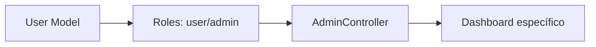
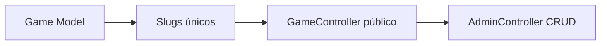
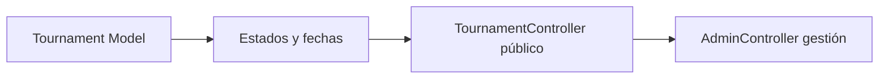
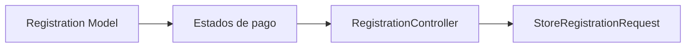

# 📚 Índice de Documentación

**Navegación completa para Obsidian**

---

## 🎯 Acceso Rápido

### 📖 **Documentación Principal**
- [[README]] - Visión general del proyecto

### 🎮 **Controladores**
- [[AdminController]] - Panel administrativo completo
- [[GameController]] - Gestión pública de juegos
- [[TournamentController]] - Gestión pública de torneos  
- [[RegistrationController]] - Sistema de inscripciones

### 🗂️ **Modelos de Datos**
- [[User Model]] - Usuarios y roles
- [[Game Model]] - Juegos TCG
- [[Tournament Model]] - Torneos y competencias
- [[Registration Model]] - Inscripciones y pagos

### 📝 **Validaciones**
- [[StoreRegistrationRequest]] - Validación de inscripciones

### 🛣️ **Sistema de Rutas**
- [[Rutas del Sistema]] - Documentación completa de rutas

### 🗄️ **Base de Datos**
- [[Esquema de Base de Datos]] - Estructura y migraciones

### 🎨 **Frontend**
- [[Componentes React]] - Interfaz de usuario

---

## 🔍 Búsqueda por Tema

### 👤 Gestión de Usuarios

### 🎮 Gestión de Juegos

### 🏆 Gestión de Torneos

### 📝 Sistema de Inscripciones

---

## 🎯 Por Tipo de Usuario

### 👤 **Usuario Anónimo**
1. [[Componentes React]] (Welcome)
2. [[GameController]] (Ver juegos)
3. [[TournamentController]] (Explorar torneos)

### 🔐 **Usuario Registrado**
1. [[RegistrationController]] (Mis inscripciones)
2. [[StoreRegistrationRequest]] (Validación)
3. [[Registration Model]] (Estados de pago)

### 👨‍💼 **Administrador**
1. [[AdminController]] (Dashboard)
2. [[User Model]] (Gestión de roles)
3. [[Esquema de Base de Datos]] (Consultas avanzadas)

---

## 🔧 Por Área Técnica

### 🖥️ **Backend (Laravel)**
- [[AdminController]] - Lógica administrativa
- [[GameController]] - API pública de juegos
- [[TournamentController]] - API pública de torneos
- [[RegistrationController]] - Gestión de inscripciones
- [[StoreRegistrationRequest]] - Validaciones
- [[User Model]] - Autenticación y roles
- [[Game Model]] - Entidad de juegos
- [[Tournament Model]] - Entidad de torneos
- [[Registration Model]] - Entidad de inscripciones

### 🌐 **Frontend (React)**
- [[Componentes React]] - Todas las vistas de usuario

### 🗄️ **Base de Datos**
- [[Esquema de Base de Datos]] - Estructura completa
- [[User Model]] - Tabla users
- [[Game Model]] - Tabla games
- [[Tournament Model]] - Tabla tournaments
- [[Registration Model]] - Tabla registrations

### 🛣️ **Routing**
- [[Rutas del Sistema]] - Todas las rutas de la aplicación

---

## 📊 Estadísticas de Documentación

| Categoría | Archivos | Estado |
|-----------|----------|--------|
| **Controladores** | 4 | ✅ Completo |
| **Modelos** | 4 | ✅ Completo |
| **Requests** | 1 | ✅ Completo |
| **Rutas** | 1 | ✅ Completo |
| **Base de Datos** | 1 | ✅ Completo |
| **Frontend** | 1 | ✅ Completo |
| **Total** | **12** | **100%** |

---

## 🎨 Características de la Documentación

### ✨ **Elementos Visuales**
- 📊 Diagramas Mermaid interactivos
- 🎯 Iconos temáticos para navegación
- 📋 Tablas organizadas de información
- 🔄 Flujos de proceso visuales

### 🔗 **Navegación**
- Enlaces bidireccionales entre documentos
- Índices temáticos y funcionales
- Navegación por roles de usuario
- Accesos rápidos por categoría

### 📱 **Responsive Design**
- Compatible con Obsidian desktop
- Visualización móvil optimizada  
- Exportación a PDF/HTML
- Sincronización en la nube

---

## 🚀 Consejos para Obsidian

### 🔧 **Configuración Recomendada**
1. **Plugins útiles**:
   - Mermaid (diagramas)
   - Advanced Tables (tablas)
   - Templater (plantillas)
   - Calendar (vista temporal)

2. **Vista de Grafos**:
   - Activar para ver relaciones
   - Filtrar por etiquetas
   - Zoom por categorías

3. **Modo Lectura**:
   - Para presentaciones
   - Para revisión de documentos
   - Para exportación

### 📝 **Navegación Eficiente**
- Usar `Ctrl+O` para búsqueda rápida
- `Ctrl+Shift+F` para búsqueda global
- `Ctrl+Click` para abrir en nueva pestaña
- Vista previa con `Ctrl+Hover`

---

*📚 Documentación técnica completa del proyecto Vulca Torneos*
*🔄 Actualizada automáticamente - Julio 2025*
