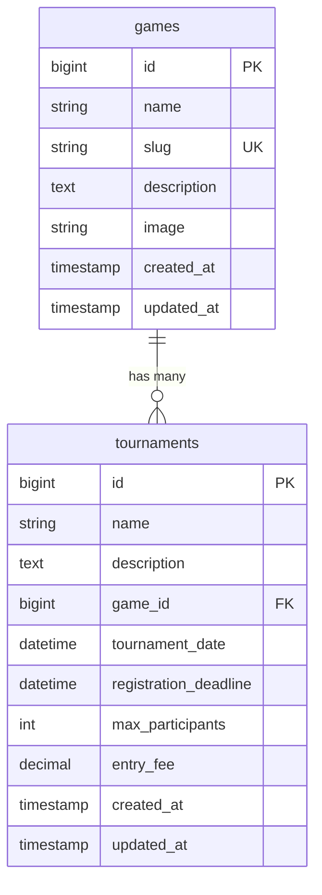
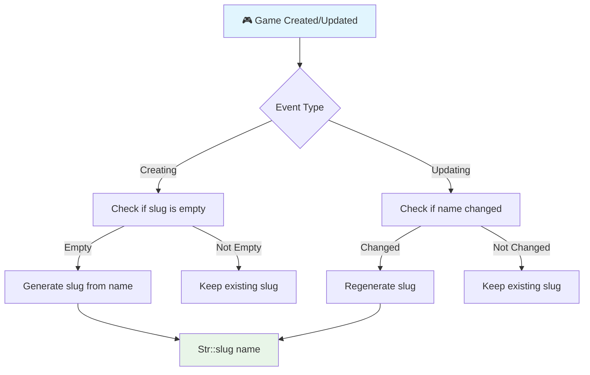
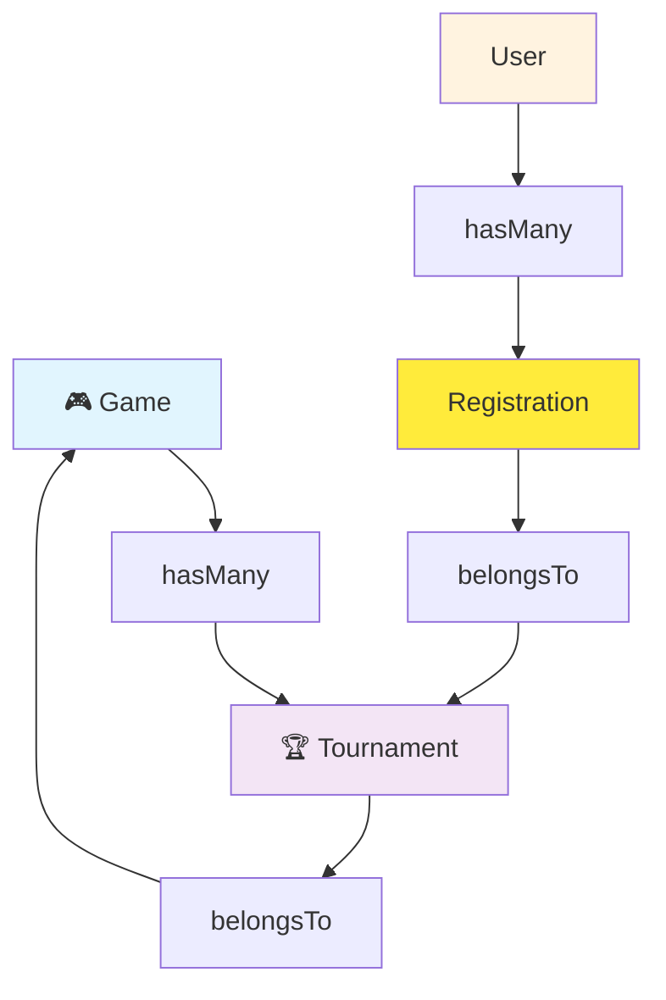
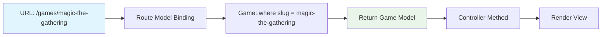
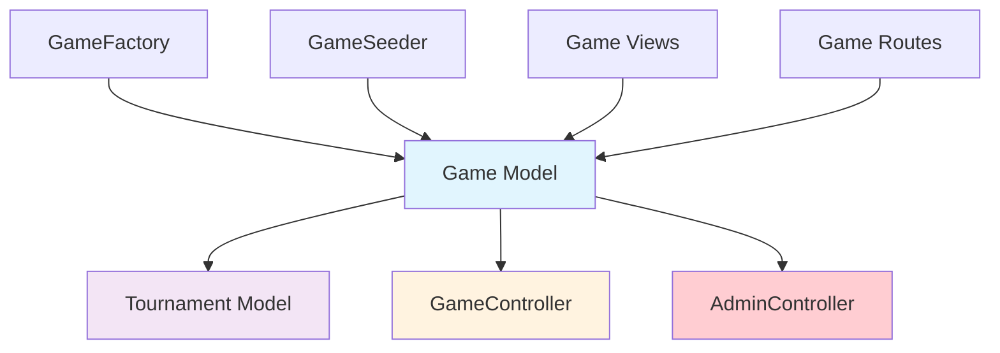

# 🎮 Game Model

**Modelo de juegos TCG**

---

## 📋 Información General

| Atributo | Valor |
|----------|-------|
| **Namespace** | `App\Models` |
| **Ruta del archivo** | `app/Models/Game.php` |
| **Tabla** | `games` |
| **Tipo** | Eloquent Model |

---

## 🎯 Propósito

El modelo `Game` representa los juegos de Trading Card Games (TCG) disponibles en la plataforma. Cada juego puede tener múltiples torneos asociados y cuenta con características como slug automático para URLs amigables.

---

## 🗂️ Estructura de la Tabla



---

## 🔧 Atributos del Modelo

### 📝 Fillable Attributes
```php
protected $fillable = [
    'name',
    'slug',
    'description',
    'image',
];
```

| Campo | Tipo | Descripción |
|-------|------|-------------|
| **name** | string | Nombre del juego |
| **slug** | string | URL amigable generada automáticamente |
| **description** | text | Descripción del juego |
| **image** | string | URL de la imagen del juego |

---

## 🔄 Eventos del Modelo

### 🚀 Boot Method
```php
protected static function boot()
{
    parent::boot();
    
    static::creating(function ($game) {
        if (empty($game->slug)) {
            $game->slug = Str::slug($game->name);
        }
    });
    
    static::updating(function ($game) {
        if ($game->isDirty('name')) {
            $game->slug = Str::slug($game->name);
        }
    });
}
```

### 📊 Diagrama de Eventos



---

## 🛠️ Métodos del Modelo

### 🔑 Route Key Name
```php
public function getRouteKeyName()
{
    return 'slug';
}
```

**Funcionalidad:**
- Permite usar el slug en lugar del ID en las rutas
- URLs más amigables: `/games/magic-the-gathering` en lugar de `/games/1`

---

## 🔗 Relaciones

### 🏆 Relación con Torneos (One-to-Many)
```php
public function tournaments()
{
    return $this->hasMany(Tournament::class);
}
```

**Uso:**
```php
$game = Game::find(1);
$tournaments = $game->tournaments;
```

---

## 📊 Diagramas de Relaciones



---

## 🎯 Casos de Uso

### 🆕 Crear Juego
```php
// El slug se genera automáticamente
$game = Game::create([
    'name' => 'Magic: The Gathering',
    'description' => 'El juego de cartas coleccionables más popular del mundo',
    'image' => 'https://example.com/mtg-logo.png'
]);

// Slug generado: 'magic-the-gathering'
echo $game->slug; // magic-the-gathering
```

### 🔍 Buscar por Slug
```php
// Buscar por slug en rutas
$game = Game::where('slug', 'magic-the-gathering')->first();

// O usando route model binding
// En la ruta: /games/{game:slug}
// Laravel automáticamente buscará por slug
```

### 📋 Obtener con Torneos
```php
$game = Game::with('tournaments')->find(1);

// Obtener juegos con conteo de torneos
$games = Game::withCount('tournaments')->get();
```

---

## 🔍 Scopes Personalizados

### 📈 Scope para Juegos Populares
```php
// Agregar al modelo
public function scopePopular($query)
{
    return $query->withCount('tournaments')
                 ->orderBy('tournaments_count', 'desc');
}
```

**Uso:**
```php
$popularGames = Game::popular()->get();
```

### 🔍 Scope para Búsqueda
```php
public function scopeSearch($query, $term)
{
    return $query->where('name', 'LIKE', "%{$term}%")
                 ->orWhere('description', 'LIKE', "%{$term}%");
}
```

**Uso:**
```php
$games = Game::search('magic')->get();
```

---

## 🏭 Factory y Seeding

### 🎲 GameFactory
```php
public function definition()
{
    return [
        'name' => $this->faker->randomElement([
            'Magic: The Gathering',
            'Pokémon TCG',
            'Yu-Gi-Oh!',
            'Legends of Runeterra',
            'Hearthstone'
        ]),
        'description' => $this->faker->paragraph(),
        'image' => $this->faker->imageUrl(400, 300, 'games'),
    ];
}
```

### 🌱 GameSeeder
```php
public function run()
{
    Game::create([
        'name' => 'Magic: The Gathering',
        'description' => 'El juego de cartas coleccionables más popular del mundo',
        'image' => '/images/games/mtg.jpg'
    ]);
    
    Game::create([
        'name' => 'Pokémon TCG',
        'description' => 'Juego de cartas basado en la popular franquicia Pokémon',
        'image' => '/images/games/pokemon.jpg'
    ]);
}
```

---

## 📊 Estadísticas del Juego

### 📈 Métodos de Estadísticas
```php
// Agregar métodos personalizados al modelo
public function getTotalTournamentsAttribute()
{
    return $this->tournaments()->count();
}

public function getActiveTournamentsAttribute()
{
    return $this->tournaments()->where('status', 'active')->count();
}

public function getTotalRegistrationsAttribute()
{
    return $this->tournaments()->withCount('registrations')->sum('registrations_count');
}
```

**Uso:**
```php
$game = Game::find(1);
echo $game->total_tournaments; // 15
echo $game->active_tournaments; // 8
echo $game->total_registrations; // 240
```

---

## 🔄 URLs Amigables

### 🌐 Configuración de Rutas
```php
// En routes/web.php
Route::get('/games/{game:slug}', [GameController::class, 'show'])->name('games.show');

// En el controlador
public function show(Game $game)
{
    // Laravel automáticamente resuelve el modelo por slug
    return view('games.show', compact('game'));
}
```

### 📊 Flujo de Resolución de Rutas



---

## 📝 Ejemplos de Consultas

### 🔍 Consultas Básicas
```php
// Obtener todos los juegos
$games = Game::all();

// Obtener juego por slug
$game = Game::where('slug', 'magic-the-gathering')->first();

// Obtener juego con torneos
$game = Game::with('tournaments')->find(1);
```

### 📊 Consultas Complejas
```php
// Juegos con más torneos
$popularGames = Game::withCount('tournaments')
    ->orderBy('tournaments_count', 'desc')
    ->take(5)
    ->get();

// Juegos con torneos activos
$activeGames = Game::whereHas('tournaments', function ($query) {
    $query->where('status', 'active');
})->get();

// Juegos con estadísticas completas
$gamesWithStats = Game::withCount([
    'tournaments',
    'tournaments as active_tournaments_count' => function ($query) {
        $query->where('status', 'active');
    }
])->get();
```

---

## 🎨 Integración con Frontend

### 📋 Datos para Vistas
```php
// En el controlador
public function index()
{
    $games = Game::withCount('tournaments')
        ->orderBy('tournaments_count', 'desc')
        ->get();
    
    return Inertia::render('Games/Index', [
        'games' => $games
    ]);
}

// En React/TypeScript
interface Game {
    id: number;
    name: string;
    slug: string;
    description: string;
    image: string;
    tournaments_count: number;
}
```

---

## 💡 Mejores Prácticas

### ✅ Buenas Prácticas
- **Slugs automáticos**: Generación automática de slugs para URLs amigables
- **Route model binding**: Usar slugs en lugar de IDs en rutas
- **Eager loading**: Cargar relaciones cuando sea necesario
- **Scopes**: Crear scopes para consultas frecuentes

### 🔍 Optimizaciones
```php
// Cargar relaciones para evitar consultas N+1
$games = Game::with('tournaments')->get();

// Usar withCount para obtener estadísticas
$games = Game::withCount('tournaments')->get();

// Cachear consultas frecuentes
$popularGames = Cache::remember('popular-games', 3600, function () {
    return Game::withCount('tournaments')
        ->orderBy('tournaments_count', 'desc')
        ->take(10)
        ->get();
});
```

---

## 🔗 Relaciones con Otros Componentes



---

## 📝 Notas Importantes

> **💡 Tip**: Los slugs se generan automáticamente al crear o actualizar el nombre del juego.

> **🔍 SEO**: El uso de slugs mejora el SEO y la experiencia del usuario.

> **⚡ Performance**: Usar withCount() en lugar de cargar todas las relaciones cuando solo necesitas el conteo.

> **🎯 Mantenibilidad**: Los scopes personalizados ayudan a mantener el código limpio y reutilizable.

---

## 🔗 Enlaces Relacionados

- [[Tournament Model]] - Modelo de torneos
- [[GameController]] - Controlador de juegos
- [[AdminController]] - Gestión administrativa
- [[GameFactory]] - Factory para crear juegos
- [[GameSeeder]] - Seeder de juegos
