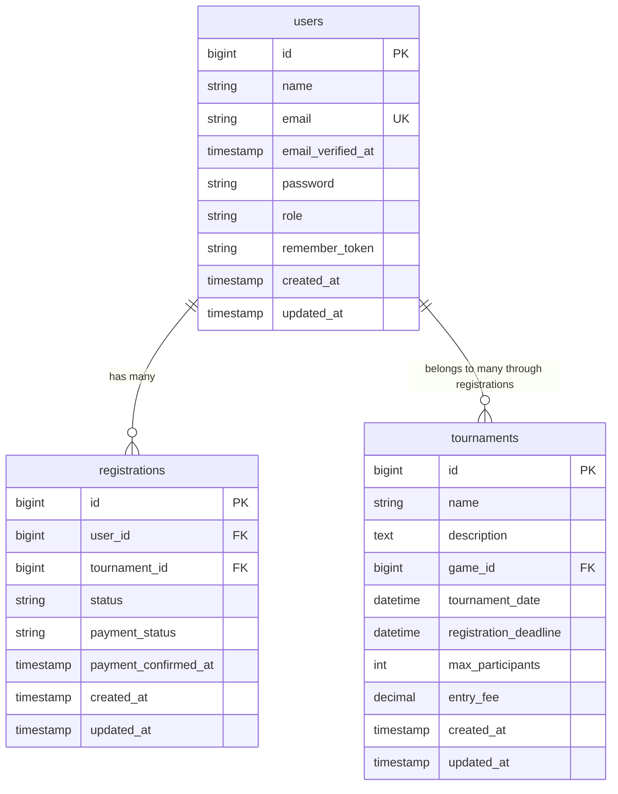
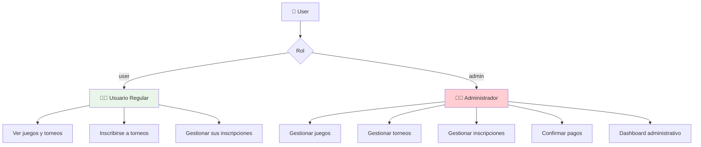
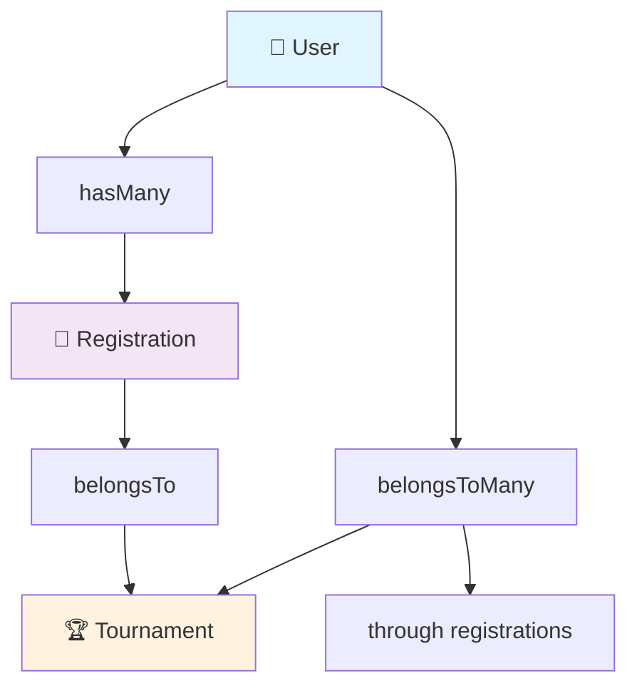
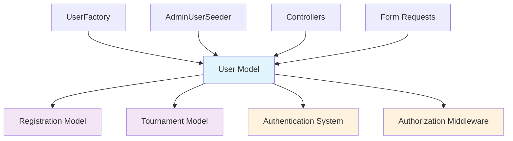

# 👤 User Model

**Modelo de usuario con roles y relaciones**

---

## 📋 Información General

| Atributo | Valor |
|----------|-------|
| **Namespace** | `App\Models` |
| **Ruta del archivo** | `app/Models/User.php` |
| **Tabla** | `users` |
| **Tipo** | Authenticatable Model |

---

## 🎯 Propósito

El modelo `User` representa a los usuarios del sistema, incluyendo tanto usuarios regulares como administradores. Gestiona la autenticación, autorización por roles, y las relaciones con inscripciones y torneos.

---

## 🗂️ Estructura de la Tabla



---

## 🔧 Atributos del Modelo

### 📝 Fillable Attributes
```php
protected $fillable = [
    'name',
    'email',
    'password',
    'role',
];
```

### 🔒 Hidden Attributes
```php
protected $hidden = [
    'password',
    'remember_token',
];
```

### 🎯 Casts
```php
protected function casts(): array
{
    return [
        'email_verified_at' => 'datetime',
        'password' => 'hashed',
    ];
}
```

---

## 👥 Sistema de Roles

### 🎭 Constantes de Roles
```php
const ROLE_USER = 'user';
const ROLE_ADMIN = 'admin';
```

### 📊 Diagrama de Roles



---

## 🛠️ Métodos del Modelo

### 🔐 Métodos de Verificación de Roles

#### `isAdmin(): bool`
```php
public function isAdmin(): bool
{
    return $this->role === self::ROLE_ADMIN;
}
```

#### `isUser(): bool`
```php
public function isUser(): bool
{
    return $this->role === self::ROLE_USER;
}
```

#### `getRoles(): array`
```php
public static function getRoles(): array
{
    return [
        self::ROLE_USER,
        self::ROLE_ADMIN,
    ];
}
```

---

## 🔍 Scopes

### 👨‍💼 Scope para Administradores
```php
public function scopeAdmins($query)
{
    return $query->where('role', self::ROLE_ADMIN);
}
```

**Uso:**
```php
$admins = User::admins()->get();
```

### 👤 Scope para Usuarios Regulares
```php
public function scopeUsers($query)
{
    return $query->where('role', self::ROLE_USER);
}
```

**Uso:**
```php
$users = User::users()->get();
```

---

## 🔗 Relaciones

### 📝 Relación con Inscripciones (One-to-Many)
```php
public function registrations()
{
    return $this->hasMany(Registration::class);
}
```

**Uso:**
```php
$user = User::find(1);
$registrations = $user->registrations;
```

### 🏆 Relación con Torneos (Many-to-Many)
```php
public function tournaments()
{
    return $this->belongsToMany(Tournament::class, 'registrations')
                ->withPivot('status', 'registered_at')
                ->withTimestamps();
}
```

**Uso:**
```php
$user = User::find(1);
$tournaments = $user->tournaments;
```

---

## 📊 Diagramas de Relaciones



---

## 🎯 Casos de Uso

### 👤 Usuario Regular
```php
// Crear usuario regular
$user = User::create([
    'name' => 'Juan Pérez',
    'email' => 'juan@example.com',
    'password' => bcrypt('password'),
    'role' => User::ROLE_USER
]);

// Verificar rol
if ($user->isUser()) {
    // Permitir acceso a funcionalidades de usuario
}

// Obtener inscripciones
$inscripciones = $user->registrations()->with('tournament')->get();
```

### 👨‍💼 Administrador
```php
// Crear administrador
$admin = User::create([
    'name' => 'Admin',
    'email' => 'admin@example.com',
    'password' => bcrypt('password'),
    'role' => User::ROLE_ADMIN
]);

// Verificar rol de administrador
if ($admin->isAdmin()) {
    // Permitir acceso al panel administrativo
}

// Obtener todos los administradores
$admins = User::admins()->get();
```

---

## 🔒 Seguridad y Autorización

### 🛡️ Middleware de Roles
```php
// En el middleware
public function handle($request, Closure $next)
{
    if (!auth()->user()->isAdmin()) {
        abort(403, 'Acceso denegado');
    }
    
    return $next($request);
}
```

### 🔐 Verificaciones en Controladores
```php
public function adminDashboard()
{
    if (!auth()->user()->isAdmin()) {
        return redirect()->route('dashboard');
    }
    
    // Lógica del dashboard admin
}
```

---

## 📊 Estadísticas del Usuario

### 📈 Métodos de Estadísticas
```php
// Agregar métodos personalizados al modelo
public function getTotalRegistrationsAttribute()
{
    return $this->registrations()->count();
}

public function getConfirmedRegistrationsAttribute()
{
    return $this->registrations()->where('status', 'confirmed')->count();
}

public function getPendingRegistrationsAttribute()
{
    return $this->registrations()->where('status', 'pending')->count();
}
```

**Uso:**
```php
$user = User::find(1);
echo $user->total_registrations; // 5
echo $user->confirmed_registrations; // 3
echo $user->pending_registrations; // 2
```

---

## 🔄 Factory y Seeding

### 🏭 UserFactory
```php
public function definition()
{
    return [
        'name' => $this->faker->name(),
        'email' => $this->faker->unique()->safeEmail(),
        'password' => bcrypt('password'),
        'role' => User::ROLE_USER,
    ];
}

// Estado para administradores
public function admin()
{
    return $this->state(function (array $attributes) {
        return [
            'role' => User::ROLE_ADMIN,
        ];
    });
}
```

### 🌱 Seeding
```php
// Crear usuarios de prueba
User::factory(10)->create();

// Crear administradores
User::factory(3)->admin()->create();
```

---

## 💡 Mejores Prácticas

### ✅ Buenas Prácticas
- **Constantes para roles**: Usar constantes en lugar de strings hardcodeados
- **Métodos de verificación**: Crear métodos específicos para verificar roles
- **Scopes**: Usar scopes para consultas frecuentes
- **Relaciones eager loading**: Cargar relaciones cuando sea necesario

### 🔍 Optimizaciones
```php
// Cargar relaciones para evitar consultas N+1
$users = User::with(['registrations.tournament'])->get();

// Usar scopes para consultas específicas
$activeUsers = User::users()->whereHas('registrations')->get();
```

---

## 📝 Ejemplos de Consultas

### 🔍 Consultas Básicas
```php
// Obtener todos los usuarios
$users = User::all();

// Obtener solo administradores
$admins = User::admins()->get();

// Obtener usuario con inscripciones
$user = User::with('registrations')->find(1);
```

### 📊 Consultas Complejas
```php
// Usuarios con inscripciones confirmadas
$usersWithConfirmedRegistrations = User::whereHas('registrations', function ($query) {
    $query->where('status', 'confirmed');
})->get();

// Usuarios más activos
$activeUsers = User::withCount('registrations')
    ->orderBy('registrations_count', 'desc')
    ->take(10)
    ->get();
```

---

## 🔗 Relaciones con Otros Componentes



---

## 📝 Notas Importantes

> **💡 Tip**: Siempre usar las constantes de roles para evitar errores de tipeo.

> **🔍 Seguridad**: Los métodos de verificación de roles son esenciales para la autorización.

> **⚡ Performance**: Usar scopes y eager loading para optimizar consultas.

> **🎯 Mantenibilidad**: Centralizar la lógica de roles en el modelo.

---

## 🔗 Enlaces Relacionados

- [[Registration Model]] - Modelo de inscripciones
- [[Tournament Model]] - Modelo de torneos
- [[AdminController]] - Controlador que usa verificaciones de roles
- [[UserFactory]] - Factory para crear usuarios
- [[AdminUserSeeder]] - Seeder para administradores
