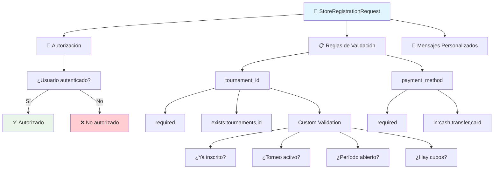
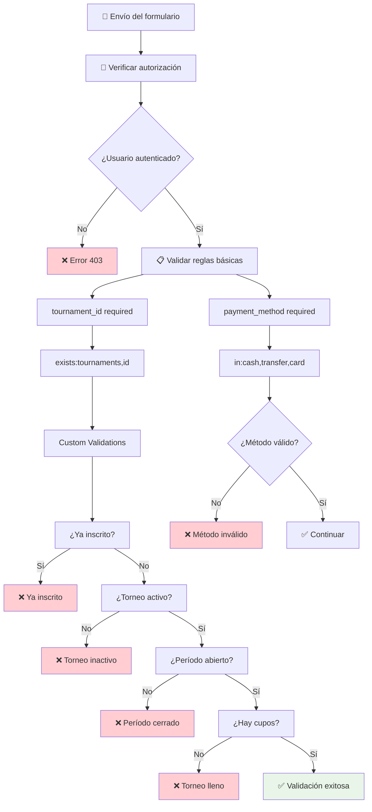
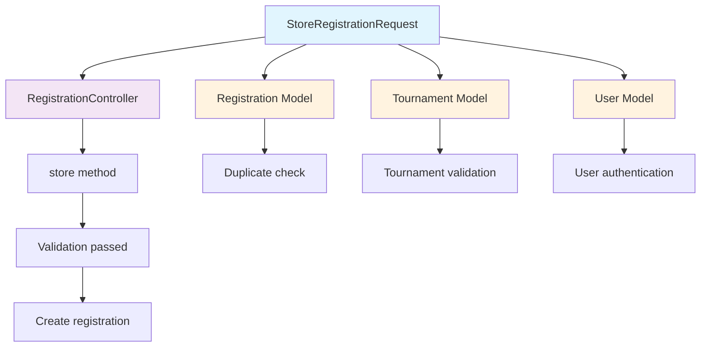

# 📝 StoreRegistrationRequest

**Form Request para validar inscripciones a torneos**

---

## 📋 Información General

| Atributo | Valor |
|----------|-------|
| **Namespace** | `App\Http\Requests` |
| **Ruta del archivo** | `app/Http/Requests/StoreRegistrationRequest.php` |
| **Tipo** | Form Request |
| **Propósito** | Validar datos de inscripción |

---

## 🎯 Propósito

El `StoreRegistrationRequest` es responsable de validar todos los datos necesarios para crear una inscripción a un torneo. Incluye validaciones de autorización, reglas de negocio complejas y mensajes de error personalizados.

---

## 🔐 Autorización

```php
public function authorize(): bool
{
    return Auth::check();
}
```

**Funcionalidad:**
- Solo usuarios autenticados pueden inscribirse
- Previene inscripciones de usuarios anónimos
- Integración con el sistema de autenticación de Laravel

---

## 🛡️ Reglas de Validación

### 📊 Estructura de Validación



---

## 🔍 Validaciones Detalladas

### 🏆 tournament_id

```php
'tournament_id' => [
    'required',
    'exists:tournaments,id',
    function ($attribute, $value, $fail) {
        // Validaciones personalizadas
    }
]
```

#### ✅ Validaciones Básicas
- **required**: Campo obligatorio
- **exists:tournaments,id**: Debe existir en la tabla tournaments

#### 🎯 Validaciones Personalizadas

##### 1. 🚫 Prevención de Inscripciones Duplicadas
```php
$existingRegistration = Registration::where('user_id', Auth::id())
    ->where('tournament_id', $value)
    ->first();

if ($existingRegistration) {
    $fail('Ya estás inscrito en este torneo.');
}
```

##### 2. 🔄 Verificación de Estado del Torneo
```php
if ($tournament && $tournament->status !== 'active') {
    $fail('Este torneo no está activo para inscripciones.');
}
```

##### 3. ⏰ Verificación de Período de Inscripción
```php
if ($tournament && $tournament->registration_ends_at && now()->isAfter($tournament->registration_ends_at)) {
    $fail('El período de inscripción para este torneo ha terminado.');
}
```

##### 4. 👥 Verificación de Capacidad
```php
if ($tournament && $tournament->registrations()->count() >= $tournament->max_participants) {
    $fail('Este torneo ya está completo.');
}
```

### 💰 payment_method

```php
'payment_method' => 'required|in:cash,transfer,card'
```

**Valores permitidos:**
- `cash`: Pago en efectivo
- `transfer`: Transferencia bancaria
- `card`: Tarjeta de crédito/débito

---

## 💬 Mensajes Personalizados

```php
public function messages(): array
{
    return [
        'tournament_id.required' => 'Debes seleccionar un torneo.',
        'tournament_id.exists' => 'El torneo seleccionado no existe.',
    ];
}
```

---

## 🔄 Flujo de Validación



---

## 📊 Casos de Uso

### ✅ Inscripción Exitosa
```json
{
    "tournament_id": 1,
    "payment_method": "cash"
}
```

### ❌ Errores Comunes

#### 1. Usuario no autenticado
```json
{
    "error": "Unauthorized",
    "message": "Authentication required"
}
```

#### 2. Torneo no existe
```json
{
    "errors": {
        "tournament_id": ["El torneo seleccionado no existe."]
    }
}
```

#### 3. Ya inscrito
```json
{
    "errors": {
        "tournament_id": ["Ya estás inscrito en este torneo."]
    }
}
```

#### 4. Torneo lleno
```json
{
    "errors": {
        "tournament_id": ["Este torneo ya está completo."]
    }
}
```

---

## 🔗 Relaciones con Otros Componentes



---

## 🎯 Características Especiales

### 🔄 Validaciones en Tiempo Real
Las validaciones personalizadas se ejecutan en cada intento de inscripción, asegurando que los datos sean válidos al momento de la creación.

### 🛡️ Seguridad Multicapa
- **Autorización**: Nivel de usuario
- **Validación básica**: Estructura de datos
- **Validación personalizada**: Reglas de negocio
- **Verificación de estado**: Consistencia de datos

### 📊 Optimización de Consultas
```php
// Consulta optimizada para verificar inscripción existente
$existingRegistration = Registration::where('user_id', Auth::id())
    ->where('tournament_id', $value)
    ->first();
```

---

## 💡 Consideraciones de UX

> **⚡ Feedback Inmediato**: Mensajes específicos para cada tipo de error.

> **🎯 Claridad**: Mensajes en español fáciles de entender.

> **🔍 Transparencia**: El usuario sabe exactamente por qué falló su inscripción.

> **📱 Consistencia**: Mismas validaciones en frontend y backend.

---

## 🔧 Casos de Prueba

### 🧪 Test Cases

```php
// Test: Usuario no autenticado
public function test_unauthorized_user_cannot_register()
{
    $tournament = Tournament::factory()->create();
    
    $response = $this->post(route('registrations.store'), [
        'tournament_id' => $tournament->id,
        'payment_method' => 'cash'
    ]);
    
    $response->assertStatus(302); // Redirect to login
}

// Test: Inscripción duplicada
public function test_user_cannot_register_twice()
{
    $user = User::factory()->create();
    $tournament = Tournament::factory()->create();
    
    Registration::factory()->create([
        'user_id' => $user->id,
        'tournament_id' => $tournament->id
    ]);
    
    $response = $this->actingAs($user)->post(route('registrations.store'), [
        'tournament_id' => $tournament->id,
        'payment_method' => 'cash'
    ]);
    
    $response->assertSessionHasErrors(['tournament_id']);
}
```

---

## 📝 Notas Importantes

> **💡 Tip**: Las validaciones personalizadas se ejecutan después de las validaciones básicas.

> **🔍 Seguridad**: Múltiples capas de validación para prevenir inscripciones inválidas.

> **⚡ Performance**: Consultas optimizadas para verificar restricciones.

> **🎯 Mantenibilidad**: Lógica de validación centralizada en el Form Request.

---

## 🔗 Enlaces Relacionados

- [[RegistrationController]] - Controlador que usa este request
- [[Registration Model]] - Modelo de datos de inscripciones
- [[Tournament Model]] - Modelo de datos de torneos
- [[User Model]] - Modelo de datos de usuarios
- [[Rutas Autenticadas]] - Rutas que requieren autenticación
