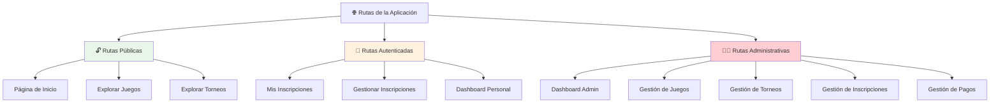
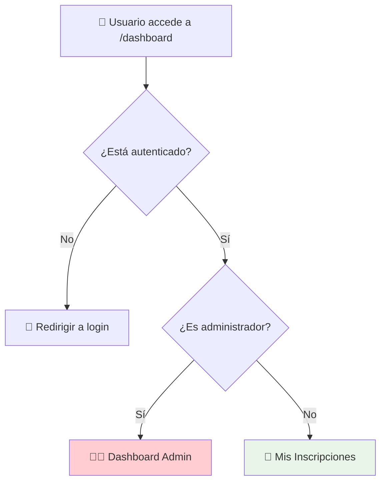
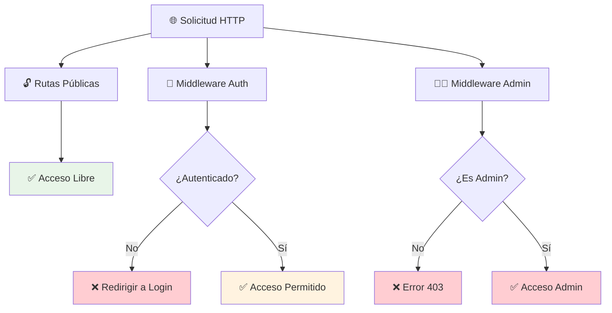
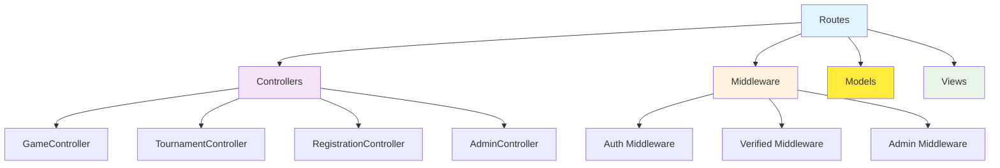

# 🛣️ Rutas del Sistema

**Documentación completa de todas las rutas de la aplicación**

---

## 📋 Información General

| Atributo | Valor |
|----------|-------|
| **Archivo principal** | `routes/web.php` |
| **Archivos adicionales** | `routes/auth.php`, `routes/settings.php` |
| **Middleware principal** | `auth`, `verified` |
| **Tipos de rutas** | Públicas, Autenticadas, Administrativas |

---

## 🎯 Arquitectura de Rutas



---

## 🔓 Rutas Públicas

**No requieren autenticación - Accesibles para cualquier visitante**

### 🏠 Página de Inicio

| Método | Ruta | Controlador | Acción | Nombre |
|--------|------|-------------|--------|--------|
| **GET** | `/` | `GameController` | `welcome` | `home` |

**Funcionalidad:**
- Muestra juegos destacados
- Punto de entrada principal
- Navegación hacia juegos y torneos

### 🎮 Gestión de Juegos

| Método | Ruta | Controlador | Acción | Nombre |
|--------|------|-------------|--------|--------|
| **GET** | `/games` | `GameController` | `index` | `games.index` |
| **GET** | `/games/{game}` | `GameController` | `show` | `games.show` |

**Funcionalidad:**
- Lista todos los juegos disponibles
- Muestra detalles de juegos específicos
- Navegación hacia torneos del juego

### 🏆 Gestión de Torneos

| Método | Ruta | Controlador | Acción | Nombre |
|--------|------|-------------|--------|--------|
| **GET** | `/tournaments` | `TournamentController` | `index` | `tournaments.index` |
| **GET** | `/tournaments/{tournament}` | `TournamentController` | `show` | `tournaments.show` |

**Funcionalidad:**
- Lista todos los torneos activos
- Muestra detalles de torneos específicos
- Información de inscripciones sin login

---

## 🔐 Rutas Autenticadas

**Requieren autenticación y verificación de email**

### 🛡️ Middleware Aplicado
```php
Route::middleware(['auth', 'verified'])->group(function () {
    // Rutas protegidas
});
```

### 📝 Gestión de Inscripciones

| Método | Ruta | Controlador | Acción | Nombre |
|--------|------|-------------|--------|--------|
| **GET** | `/my-registrations` | `RegistrationController` | `index` | `registrations.index` |
| **POST** | `/registrations` | `RegistrationController` | `store` | `registrations.store` |
| **PATCH** | `/registrations/{registration}` | `RegistrationController` | `update` | `registrations.update` |
| **DELETE** | `/registrations/{registration}` | `RegistrationController` | `destroy` | `registrations.destroy` |

**Funcionalidad:**
- Ver inscripciones del usuario
- Crear nueva inscripción
- Actualizar inscripción (cambiar estado)
- Cancelar inscripción

---

## 👨‍💼 Rutas Administrativas

**Solo para usuarios con rol de administrador**

### 🛡️ Middleware y Configuración
```php
Route::middleware(['auth', 'verified'])
    ->prefix('admin')
    ->name('admin.')
    ->group(function () {
        // Rutas administrativas
    });
```

### 📊 Dashboard Administrativo

| Método | Ruta | Controlador | Acción | Nombre |
|--------|------|-------------|--------|--------|
| **GET** | `/admin/dashboard` | `AdminController` | `index` | `admin.dashboard` |

**Funcionalidad:**
- Panel de control con estadísticas
- Resumen de actividad del sistema
- Accesos rápidos a gestión

### 🎮 Gestión de Juegos

| Método | Ruta | Controlador | Acción | Nombre |
|--------|------|-------------|--------|--------|
| **GET** | `/admin/games` | `AdminController` | `games` | `admin.games.index` |
| **GET** | `/admin/games/create` | `AdminController` | `createGame` | `admin.games.create` |
| **POST** | `/admin/games` | `AdminController` | `storeGame` | `admin.games.store` |
| **GET** | `/admin/games/{game}/edit` | `AdminController` | `editGame` | `admin.games.edit` |
| **PATCH** | `/admin/games/{game}` | `AdminController` | `updateGame` | `admin.games.update` |
| **DELETE** | `/admin/games/{game}` | `AdminController` | `destroyGame` | `admin.games.destroy` |

### 🏆 Gestión de Torneos

| Método | Ruta | Controlador | Acción | Nombre |
|--------|------|-------------|--------|--------|
| **GET** | `/admin/tournaments` | `AdminController` | `tournaments` | `admin.tournaments.index` |
| **GET** | `/admin/tournaments/create` | `AdminController` | `createTournament` | `admin.tournaments.create` |
| **POST** | `/admin/tournaments` | `AdminController` | `storeTournament` | `admin.tournaments.store` |
| **GET** | `/admin/tournaments/{tournament}/edit` | `AdminController` | `editTournament` | `admin.tournaments.edit` |
| **PATCH** | `/admin/tournaments/{tournament}` | `AdminController` | `updateTournament` | `admin.tournaments.update` |
| **DELETE** | `/admin/tournaments/{tournament}` | `AdminController` | `destroyTournament` | `admin.tournaments.destroy` |

### 📝 Gestión de Inscripciones

| Método | Ruta | Controlador | Acción | Nombre |
|--------|------|-------------|--------|--------|
| **GET** | `/admin/registrations` | `AdminController` | `registrations` | `admin.registrations.index` |
| **PATCH** | `/admin/registrations/{registration}` | `AdminController` | `updateRegistration` | `admin.registrations.update` |
| **DELETE** | `/admin/registrations/{registration}` | `AdminController` | `destroyRegistration` | `admin.registrations.destroy` |

### 💰 Gestión de Pagos

| Método | Ruta | Controlador | Acción | Nombre |
|--------|------|-------------|--------|--------|
| **GET** | `/admin/payments` | `AdminController` | `payments` | `admin.payments.index` |
| **PATCH** | `/admin/payments/{registration}/confirm` | `AdminController` | `confirmPayment` | `admin.payments.confirm` |

---

## 🔄 Redirección Inteligente del Dashboard

```php
Route::middleware(['auth', 'verified'])->get('/dashboard', function () {
    if (auth()->user()->isAdmin()) {
        return redirect()->route('admin.dashboard');
    }
    return redirect()->route('registrations.index');
})->name('dashboard');
```

### 📊 Flujo de Redirección



---

## 🔗 Archivos de Rutas Adicionales

### 🔐 Rutas de Autenticación (`routes/auth.php`)
- Login y logout
- Registro de usuarios
- Recuperación de contraseñas
- Verificación de email

### ⚙️ Rutas de Configuración (`routes/settings.php`)
- Perfil de usuario
- Configuración de cuenta
- Cambio de contraseña

---

## 🛡️ Seguridad y Middleware

### 🔒 Middleware Utilizados

| Middleware | Descripción | Aplicación |
|------------|-------------|------------|
| **auth** | Verifica autenticación | Rutas protegidas |
| **verified** | Verifica email confirmado | Rutas autenticadas |
| **admin** | Verifica rol de administrador | Rutas administrativas |

### 🎯 Protección por Niveles



---

## 📱 Patrones de URL

### 🔗 Estructura de URLs

```
📁 Públicas
├── /                          # Página de inicio
├── /games                     # Lista de juegos
├── /games/{slug}              # Detalle de juego
├── /tournaments               # Lista de torneos
└── /tournaments/{id}          # Detalle de torneo

📁 Autenticadas
├── /my-registrations          # Mis inscripciones
├── /registrations             # Crear inscripción
└── /dashboard                 # Redirigir según rol

📁 Administrativas
├── /admin/dashboard           # Dashboard admin
├── /admin/games/*             # CRUD de juegos
├── /admin/tournaments/*       # CRUD de torneos
├── /admin/registrations       # Gestión de inscripciones
└── /admin/payments            # Gestión de pagos
```

---

## 🎯 Casos de Uso por Tipo de Usuario

### 👤 Usuario Anónimo
```mermaid
graph LR
    A[🌐 Visita /] --> B[Ver juegos destacados]
    B --> C[Explorar /games]
    C --> D[Ver detalles /games/{slug}]
    D --> E[Ver torneos /tournaments]
    E --> F[Detalle torneo /tournaments/{id}]
    F --> G[🔐 Inscribirse - Requiere login]
```

### 🔐 Usuario Autenticado
```mermaid
graph LR
    A[🔐 Login exitoso] --> B[/dashboard]
    B --> C[/my-registrations]
    C --> D[Ver mis inscripciones]
    D --> E[Inscribirse a torneo]
    E --> F[Gestionar inscripciones]
```

### 👨‍💼 Administrador
```mermaid
graph LR
    A[👨‍💼 Admin login] --> B[/admin/dashboard]
    B --> C[Gestionar juegos]
    B --> D[Gestionar torneos]
    B --> E[Ver inscripciones]
    B --> F[Confirmar pagos]
```

---

## 📊 Estadísticas de Rutas

### 📈 Conteo por Tipo

| Tipo de Ruta | Cantidad | Porcentaje |
|--------------|----------|------------|
| **Públicas** | 5 | 25% |
| **Autenticadas** | 4 | 20% |
| **Administrativas** | 11 | 55% |
| **Total** | 20 | 100% |

### 🔍 Métodos HTTP Utilizados

| Método | Cantidad | Uso Principal |
|--------|----------|---------------|
| **GET** | 12 | Visualización |
| **POST** | 2 | Creación |
| **PATCH** | 4 | Actualización |
| **DELETE** | 2 | Eliminación |

---

## 💡 Mejores Prácticas Implementadas

### ✅ Características Destacadas

1. **Nomenclatura Consistente**: Nombres de rutas siguen convenciones estándar
2. **Agrupación Lógica**: Rutas agrupadas por funcionalidad y middleware
3. **Prefijos Organizados**: Rutas administrativas con prefijo `/admin`
4. **Documentación Inline**: Comentarios explicativos en el archivo de rutas
5. **Middleware Apropiado**: Protección por niveles de acceso
6. **Redirección Inteligente**: Dashboard redirige según rol del usuario

### 🔧 Optimizaciones

```php
// Agrupación eficiente de middleware
Route::middleware(['auth', 'verified'])->group(function () {
    // Múltiples rutas con el mismo middleware
});

// Prefijos para organización
Route::prefix('admin')->name('admin.')->group(function () {
    // Rutas administrativas organizadas
});
```

---

## 🔗 Relaciones con Otros Componentes



---

## 📝 Notas Importantes

> **💡 Tip**: Las rutas públicas permiten explorar sin barreras, aumentando la conversión a usuarios registrados.

> **🔒 Seguridad**: Múltiples capas de middleware protegen las rutas sensibles.

> **📱 UX**: La redirección inteligente del dashboard mejora la experiencia del usuario.

> **🎯 Mantenibilidad**: La organización clara facilita el mantenimiento y expansión del sistema.

---

## 🔗 Enlaces Relacionados

- [[GameController]] - Controlador de juegos
- [[TournamentController]] - Controlador de torneos
- [[RegistrationController]] - Controlador de inscripciones
- [[AdminController]] - Controlador administrativo
- [[User Model]] - Modelo de usuarios con roles
